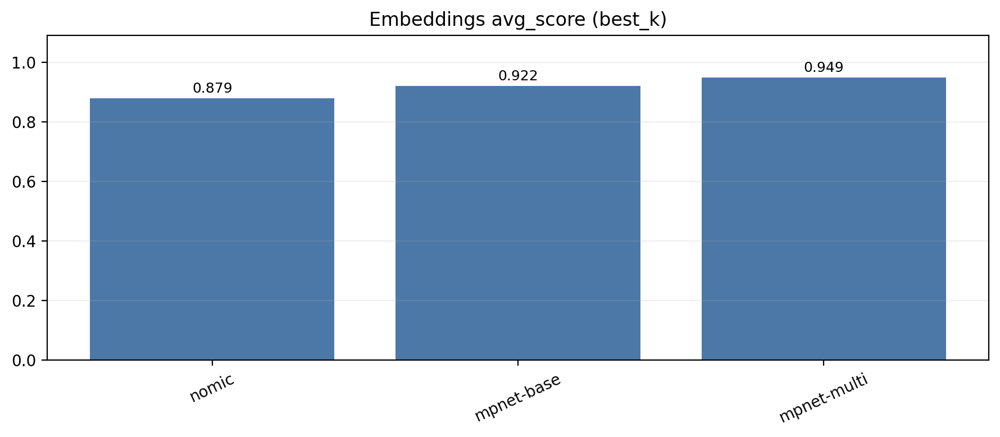
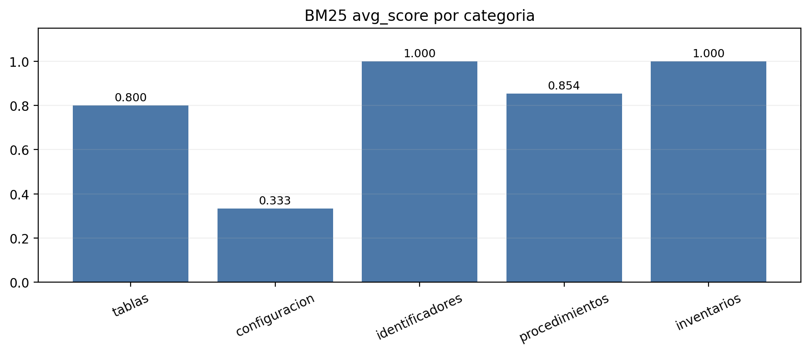
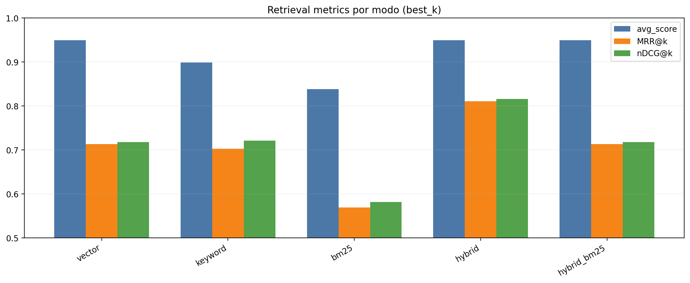
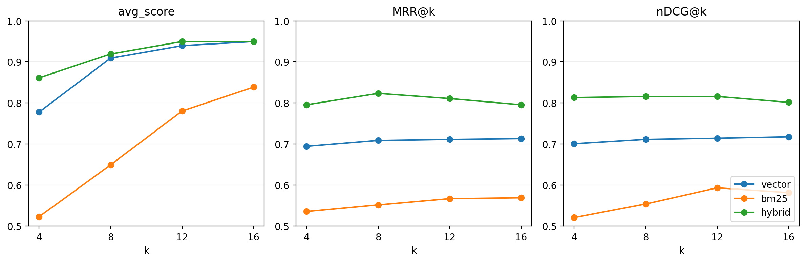
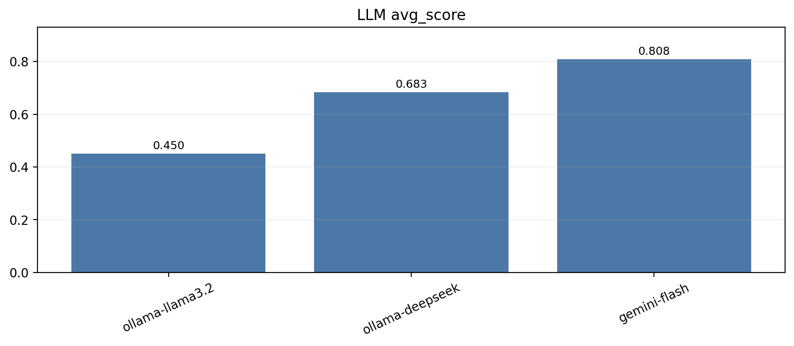

# Sistema RAG Multiformato para Documentación de Soporte

El objetivo es diseñar, implementar y evaluar un sistema de **Retrieval-Augmented Generation (RAG)** aplicado a documentación interna de soporte técnico, poniendo el foco en el impacto de las estrategias de recuperación sobre la calidad de las respuestas generadas.

El sistema permite responder preguntas factuales y procedimentales a partir de documentos heterogéneos, evaluando de forma **reproducible y cuantitativa** distintas configuraciones de retrieval y generación.

A lo largo del documento se distingue explícitamente entre **retrieval** (recuperación de contexto relevante) y **generation** (generación de la respuesta final por el modelo LLM), evaluándose ambos componentes de forma independiente.

---

## 1. Objetivo del proyecto

El objetivo principal de este proyecto es construir un sistema RAG que:

- Responda preguntas sobre documentación interna de soporte técnico.
- Reduzca al mínimo las alucinaciones mediante recuperación explícita de contexto.
- Permita comparar distintas estrategias de recuperación de información de forma controlada.
- Justifique técnicamente las decisiones adoptadas mediante métricas objetivas.

El foco del proyecto no es únicamente la generación de texto, sino el **análisis del papel del retrieval como componente crítico en sistemas RAG**, especialmente en dominios donde la precisión factual es prioritaria frente a la creatividad.

El proyecto pone el foco en la etapa de recuperación, al considerarse el principal factor determinante de la precisión factual en sistemas RAG aplicados a documentación técnica.

---

## 2. Dominio y descripción de los datos

El corpus simula un entorno realista de documentación interna de una organización tecnológica e incluye información de distinta naturaleza:

- KPIs y métricas operativas
- Configuración de servicios
- Procedimientos operativos y FAQs
- Políticas internas y on-call
- Inventario de servicios y activos
- Histórico de incidentes
- Organigrama y roles técnicos

Los documentos se presentan en **5 formatos distintos**, reproduciendo la heterogeneidad habitual en entornos empresariales reales:
- **PDF**: manuales y políticas operativas (p. ej. `manual_soporte.pdf`, `politicas_operativas.pdf`)
- **CSV**: KPIs e inventario de servicios (p. ej. `kpis_trimestrales.csv`, `inventario_servicios.csv`)
- **JSON**: configuración e inventario (p. ej. `config_servicio.json`, `inventario_hardware.json`)
- **Markdown**: procedimientos y organigrama (p. ej. `procedimiento_oncall.md`, `organigrama_soporte.md`)
- **TXT**: FAQs e histórico de incidentes (p. ej. `faq_soporte.txt`, `historico_incidentes_criticos.txt`)

---

## 3. Planteamiento experimental y alcance

Se evalúan de forma controlada tres componentes clave del sistema:
- embeddings
- retrieval
- generación

Quedan fuera del alcance:
- fine-tuning de modelos
- aprendizaje online
- entrenamiento supervisado con datos externos

---
## 4. Conjunto de evaluación

La evaluación se realiza mediante un **test set manualmente definido**, compuesto por preguntas representativas del dominio.

El conjunto está definido en `src/eval_data.py` como `TEST_SET` y se reutiliza en los benchmarks de embeddings, retrieval y LLM para evaluar de forma comparable cada etapa del pipeline.

Cada entrada del test set incluye:
- **question**: la consulta a evaluar.
- **expected**: lista de tokens/entidades que deben aparecer (números, IDs, versiones, emails).
- **expect_text**: respuesta canónica en texto para comparar similitud semántica.
- **category**: etiqueta semántica (tablas, configuración, identificadores, procedimientos, inventarios).
  - Se usa para **desglosar métricas por tipo de pregunta** y detectar qué estrategias de retrieval/LLM funcionan mejor o peor según el tipo de información.

Diseño del test set:
- **Tablas (CSV)**: busca extraer valores numéricos exactos (SLA, CSAT, tickets).
- **Configuración (JSON)**: verifica claves y parámetros críticos (versiones, features, umbrales).
- **Identificadores**: exige coincidencia exacta de IDs, emails y versiones.
- **Procedimientos**: comprueba pasos y acciones clave en textos largos.
- **Inventarios**: valida estados y owners asociados a servicios.

Este enfoque permite evaluar:
- Coincidencia parcial por tokens (retrieval).
- Calidad global por similitud semántica (LLM).
- Robustez frente a diferentes tipos de pregunta.

Ejemplos reales del TEST_SET:
```
{"question": "Cual es el SLA cumplido en Q4 y cuantos tickets abiertos hubo?",
 "expected": ["93.1", "1500"],
 "expect_text": "En Q4 el SLA cumplido es 93.1% y hubo 1500 tickets abiertos.",
 "category": "tablas"}

{"question": "Cual es la version del servicio principal?",
 "expected": ["2.3.1"],
 "expect_text": "La versión del servicio principal (core_api) es 2.3.1.",
 "category": "identificadores"}

{"question": "Que pasos de troubleshooting se realizan antes de escalar?",
 "expected": ["verificar", "credenciales", "logs"],
 "expect_text": "Antes de escalar se realiza troubleshooting: verificar credenciales, revisar logs y comprobar estado del servicio.",
 "category": "procedimientos"}
```

---

## 5. Métricas de evaluación

### 5.1 Métricas de recuperación
- **avg_score (top‑k)**:  
  `avg_score = (# tokens esperados presentes en top‑k) / (total tokens esperados)`
  - Ejemplo: expected = `[\"93.1\", \"1500\"]`, contexto contiene ambos → `avg_score=1.0`. Si solo aparece uno → `0.5`.
  - Rango: 0 a 1.
- **Recall@k**:  
  `Recall@k = 1` si existe algún chunk relevante, si no 0.
  - Ejemplo: si algún chunk del top‑k contiene al menos un token esperado → `Recall@k=1`.
  - Rango: 0 o 1.
- **MRR@k**:  
  `MRR@k = 1 / rank_del_primer_chunk_relevante` (0 si no hay relevante).
  - Ejemplo: primer relevante en posición 2 → `MRR@k=0.5`.
  - Rango: 0 a 1.
- **nDCG@k**:  
  `nDCG = DCG / IDCG`, con `rel_i` = proporción de tokens esperados en cada chunk.  
  Intuición: mide la calidad del **orden**; vale 1.0 si los chunks más relevantes aparecen arriba.  
  - Ejemplo: si el chunk con mayor `rel` está en posición 1 → nDCG alto; si aparece en posición 3 → nDCG baja.
  - Rango: 0 a 1.
- **context_precision@k**:  
  `context_precision = (# tokens esperados presentes) / (# tokens totales en top‑k)`  
  Se usa para comparar ruido relativo entre estrategias con cobertura similar.
  - Ejemplo: 2 tokens esperados encontrados en 200 tokens de contexto → `0.01`.
  - Rango: 0 a 1.

Normalización común: `lower()`, sin tildes, espacios colapsados (puntuación opcional).

### 5.2 Métricas de respuesta
- **score (contains‑match)**: proporción de tokens esperados presentes en la respuesta del LLM.  
  - Definición:  
    `score = (# tokens esperados presentes) / (total tokens esperados)`
  - Normalización: misma normalización que en retrieval.
  - Ejemplo: expected = `[\"2.3.1\"]` y la respuesta incluye `2.3.1` → `score=1.0`.
  - Rango: 0 a 1.
- **semantic_similarity**:  
  `sim = cos(emb(respuesta), emb(expect_text))` con `sentence-transformers`.
  - Rango: -1 a 1 (en práctica suele estar entre 0 y 1).
- **groundedness**: penaliza entidades fuera del contexto (emails, IDs, versiones).
  - Ejemplo: si la respuesta menciona `user@corp.com` pero no está en el contexto, groundedness baja.
  - Rango: 0 a 1.
- **latencias**: `retrieval_s`, `generation_s`, `total_s`.
  - Rango: 0 a ∞ (segundos).

### 5.3 Relación métrica → benchmark → objetivo

- **benchmark_embeddings**  
  - Métrica principal: `avg_score` (top‑k) sobre retrieval vectorial.  
  - Objetivo: seleccionar el mejor modelo de embeddings.

- **benchmark_retrieval**  
  - Métricas: `avg_score`, `Recall@k`, `MRR@k`, `nDCG@k`.  
  - Objetivo: comparar estrategias de retrieval (vector, BM25, híbridos, rerank).

- **benchmark_llm**  
  - Métricas: `score`, `semantic_similarity`, `groundedness`, latencias.  
  - Objetivo: evaluar calidad final de respuesta y elegir el LLM ganador.

---

## 6. Arquitectura del sistema

### 6.1 Visión general del pipeline

Arquitectura RAG modular y reproducible:
- Ingestión + limpieza
- Chunking
- Embeddings + FAISS
- Retrieval (vector/TF‑IDF/BM25/híbrido)
- Generación
- Evaluación

Flujo: Ingesta → Limpieza → Chunking → Embeddings → Indexación → Retrieval → LLM → Métricas.

Cada chunk conserva metadatos (`source`, `doc_id`, offsets, `section_title`) para trazabilidad. El diseño desacoplado permite sustituir modelos o variantes de chunking/retrieval sin reescribir el pipeline.

---

### 6.1.1 Esquema textual del sistema completo

```
Documentos (PDF / CSV / JSON / MD / TXT)
        │
        ▼
Loaders por formato (src/loaders/*)
        │
        ▼
Limpieza y normalización (src/preprocessing.py)
        │
        ▼
Chunking por tipo (src/chunking.py)
        │
        ▼
Embeddings (sentence-transformers / Ollama)
        │
        ▼
Vector store FAISS (index/index.faiss + index/data.json)
        │
        ▼
Retrieval: vector / TF‑IDF / BM25 / híbrido (+ rerank opcional)
        │
        ▼
Prompt + LLM (Ollama / Gemini)
        │
        ▼
Respuesta final
        │
        ▼
Evaluación y visualizaciones (scripts/eval.py, scripts/generate_plots.py)
```

Módulos y herramientas:
- **Extracción**: loaders por formato (PDF/CSV/JSON/MD/TXT).
- **Procesamiento**: limpieza + normalización + chunking específico por tipo.
- **Embeddings**: `paraphrase-multilingual-mpnet-base-v2` (Sentence-Transformers) u Ollama.
- **Vector DB**: FAISS local con metadatos persistidos.
- **Recuperación**: vector / TF‑IDF / BM25 / híbrido (alpha), con reranking opcional.
- **Generación**: LLM local (Ollama) o remoto (Gemini).
- **Resultados**: métricas + plots en `visualizations/`.

---

### 6.2 Ingestión y chunking

### 6.2.1 Ingestión multiformato

Los documentos se normalizan a texto y metadatos mínimos para asegurar trazabilidad.  
La ingesta se ejecuta en `scripts/build_index.py` y en los benchmarks.

Loaders:
- PDF: texto + tablas con marcador `[TABLAS]`.
- CSV/JSON: filas/keys a texto plano.
- TXT/MD: lectura directa preservando estructura.

Ejemplos:

- **PDF** (texto + tablas):
```
...contenido de la página...

[TABLAS]
columna1,columna2,columna3
valor1,valor2,valor3
```
- **CSV** (una fila por chunk en texto legible):
```
trimestre: Q4; tickets_abiertos: 1500; tickets_cerrados: 1470; sla_cumplido_pct: 93.1; csat_promedio: 4.7
```
- **JSON** (keys y valores aplanados):
```
servicio: core_api
version: 2.3.1
features.0: autenticacion_segura
alerting.cpu: 85
```
- **Markdown / TXT** (preserva estructura y headings):
```
# Proceso de escalado
## Nivel 1
Validar credenciales y revisar logs...
```

### 6.2.2 Estrategia de segmentación (chunking)

La segmentación se adapta al tipo de documento para preservar coherencia semántica y evitar contaminación entre registros:

- **Documentos narrativos (PDF, Markdown, TXT)**  
  Chunking semántico por secciones (headings) combinado con ventana deslizante con solape.  
  - Parámetros: `max_size=500`, `overlap=60`.

- **Documentos estructurados (CSV, JSON)**  
  Chunking fijo sin solape.  
  - Parámetros: `size=400`, `overlap=0`.

---


### 6.3 Almacenamiento vectorial (FAISS)

Embeddings en FAISS (`index/index.faiss`) con metadatos en `index/data.json`.  
Se elige por simplicidad local, buen rendimiento en CPU y compatibilidad con similitud coseno (inner product).

Alternativas:
- **Chroma**: ofrece API de alto nivel, colecciones y persistencia integrada; útil si se busca una capa tipo “vector DB” con más features, pero añade dependencias y overhead.
- **Elasticsearch/OpenSearch**: potencia para filtrado, escalado y búsquedas híbridas, a costa de despliegue y mantenimiento (cluster, índices, recursos).
- **Annoy/HNSWlib**: ligeros y rápidos en CPU para nearest‑neighbor, pero con menos herramientas de persistencia/metadata y menos flexibilidad en configuración.


---
### 6.4 Embeddings (modelos y benchmark)

Se evalúan varios modelos de embeddings para seleccionar el que mejor recupera contexto en el dominio.

Modelos evaluados:
- `paraphrase-multilingual-mpnet-base-v2` (multilingüe)
- `all-mpnet-base-v2` (inglés generalista)
- `nomic-embed-text` (local vía Ollama)

Benchmark de embeddings:
- Métrica principal: `avg_score` en top‑k usando retrieval vectorial.
- Grid de `k`: `k ∈ {4, 8, 12, 16}`.
- Objetivo: maximizar cobertura de tokens esperados
  - Interpretación: mayor `avg_score` implica que el embedding recupera chunks que contienen más evidencia exacta (IDs, números, versiones), por tanto es mejor para extraer contexto útil con el mismo pipeline.
  - Limitación: favorece coincidencia literal; no mide orden fino del ranking (eso se analiza en benchmark de retrieval con MRR/nDCG).
  
**Nota importante**: aquí se usa **solo retrieval vectorial** para aislar el efecto del embedding.

Selección:
- Se elige el modelo con mayor `avg_score`.

Resultados (best_k por modelo):

| Modelo | best_k | avg_score | min_score | max_score |
|------|--------|-----------|-----------|-----------|
| paraphrase-multilingual-mpnet-base-v2 | 16 | 0.949 | 0.000 | 1.000 |
| all-mpnet-base-v2 | 16 | 0.922 | 0.000 | 1.000 |
| nomic-embed-text | 16 | 0.879 | 0.000 | 1.000 |



---

## 7. Estrategias de recuperación (Retrieval)

Dado que el corpus contiene tanto información altamente estructurada como documentación narrativa, el sistema evalúa múltiples estrategias de recuperación.

### 7.1 Recuperación léxica (TF‑IDF)

TF‑IDF es un baseline léxico sencillo basado en frecuencia de términos y ponderación inversa por documento.  
Sirve como referencia rápida cuando la consulta contiene palabras clave explícitas.

Fortalezas:
- IDs, nombres propios y términos exactos.
- Consultas cortas con vocabulario muy específico.

Limitaciones:
- No capta sinónimos ni reformulaciones.
- Sensible a ruido y variaciones léxicas.

---

### 7.2 Recuperación léxica (BM25)

BM25 es el baseline léxico clásico basado en coincidencia de términos ponderada por frecuencia y longitud del documento.  
Es especialmente robusto cuando la consulta contiene tokens críticos que deben aparecer literalmente en el contexto.

Fortalezas:
- IDs, versiones, comandos, tickets, emails, nombres propios.
- Consultas con valores numéricos exactos o claves de configuración.

Limitaciones:
- Pierde rendimiento con reformulación semántica o sinónimos.
- No capta relaciones semánticas sin coincidencia literal.

---

### 7.3 Recuperación semántica (Vector Search)

Embeddings densos para recuperar contexto aunque no haya coincidencia literal.  
El ranking se basa en similitud coseno entre consulta y chunks.

Fortalezas:
- Procedimientos, FAQs y documentación narrativa.
- Reformulaciones donde el significado se mantiene sin compartir términos.

Limitaciones:
- Puede diluir tokens críticos exactos (IDs o valores).
- Depende de la calidad del embedding para capturar el dominio.

En este proyecto los embeddings se usan como extractores de características (sin fine‑tuning).

---

### 7.4 Recuperación híbrida (Vector + léxico)

Fusión de rankings (parámetro `retriever_alpha`) para combinar precisión léxica y generalización semántica.
Permite sumar evidencias de ambos mundos sin clasificar la consulta a priori.

Variantes evaluadas:
- **hybrid**: embeddings + TF‑IDF.
- **hybrid_bm25**: embeddings + BM25.

Ventajas:
- Mantiene robustez léxica en tokens críticos.
- Mejora la cobertura semántica en texto descriptivo.
- Reduce el riesgo de que un único método domine el ranking.

---

### 7.5 Re-ranking (opcional)

Reordena el top‑k con un cross‑encoder que evalúa consulta‑chunk de forma conjunta.  
Puede mejorar el orden final cuando el contexto es limitado, pero añade latencia.

Se evalúa por separado y se mantiene desactivado en configuración final al no mejorar métricas globales en este corpus.

---

### 7.6 Benchmark específico de BM25

Grid search de `k1` y `b` para fijar la mejor configuración antes de comparar retrievers.  
Mejor combinación: `k1=0.9`, `b=0.25`, `best_k=16`, `avg_score=0.838` (min 0.000, max 1.000).  
No se observan diferencias grandes entre combinaciones en este corpus; se fija esa configuración.

Desglose por categoria (best_k=16):

| Categoria | avg_score |
| --- | --- |
| tablas | 0.80 |
| configuracion | 0.33 |
| identificadores | 1.00 |
| procedimientos | 0.85 |
| inventarios | 1.00 |

Grid de combinaciones probadas (BM25):
- `k1`: [0.9, 1.2, 1.5, 1.8, 2.0]
- `b`: [0.25, 0.5, 0.75, 0.9]



---

### 7.7 Resultados del benchmark de retrieval

Métrica principal: `avg_score` (proporción de tokens esperados presentes en el top‑k concatenado).
Grid de k evaluado (retrieval): `k ∈ {4, 8, 12, 16}` para cada modo.

Resultados (mejor K por modo).  
Nota: **hybrid = vector + TF‑IDF**, **hybrid_bm25 = vector + BM25**.

| Modo | best_k | avg_score | context_precision@k | Recall@k | MRR@k | nDCG@k |
|------|--------|-----------|--------------------|----------|-------|--------|
| vector | 16 | 0.949 | 0.004 | 0.970 | 0.713 | 0.718 |
| keyword (TF-IDF) | 16 | 0.899 | 0.003 | 0.939 | 0.703 | 0.721 |
| bm25 (tuneado) | 16 | 0.838 | 0.003 | 0.879 | 0.569 | 0.581 |
| hybrid | 12 | 0.949 | 0.005 | 0.970 | 0.811 | 0.816 |
| hybrid_bm25 | 16 | 0.949 | 0.004 | 0.970 | 0.713 | 0.718 |
| vector_rerank | 12 | 0.939 | 0.004 | 0.939 | 0.735 | 0.755 |
| keyword_rerank | 12 | 0.891 | 0.003 | 0.939 | 0.718 | 0.736 |
| bm25_rerank | 16 | 0.828 | 0.003 | 0.848 | 0.681 | 0.687 |
| hybrid_rerank | 12 | 0.949 | 0.005 | 0.970 | 0.767 | 0.779 |
| hybrid_bm25_rerank | 12 | 0.939 | 0.004 | 0.939 | 0.735 | 0.755 |




Conclusión: `vector`, `hybrid` (vector + TF‑IDF) y `hybrid_bm25` empatan en rendimiento; se selecciona `hybrid_bm25` por robustez. El reranking no mejora y se mantiene desactivado.

---

### 7.8 Propuesta de mejora e impacto

Mejora propuesta: **retrieval híbrido** (vector + BM25) con BM25 tuneado.  
Impacto observado:
- Mantiene el mismo `avg_score` que el vector puro (misma cobertura).
- Mejora el ranking (`MRR@k`, `nDCG@k`), lo que prioriza chunks más útiles en el top‑k.
- Aporta robustez léxica sin sacrificar desempeño en consultas semánticas.

Decisión: se adopta el híbrido como configuración final. El reranking se descarta por latencia y por no mejorar métricas globales en este corpus.

---

### 7.9 Versión básica vs versión mejorada

- **Versión básica (baseline)**: retrieval **vectorial** puro.
  - `retriever_type = "vector"` en `config.json`.
- **Versión mejorada (propuesta)**: retrieval **híbrido vector + BM25** con BM25 tuneado.
  - `retriever_type = "hybrid_bm25"`, `retriever_alpha = 0.6`, `bm25_k1 = 0.9`, `bm25_b = 0.25`.

Estas dos variantes usan el mismo pipeline y permiten comparar directamente el impacto de la mejora propuesta en métricas de ranking y calidad final.

---
## 8. Generación de respuestas

El LLM responde solo con el contexto recuperado.

### 8.1 Configuración de generación

La generación se realiza con modelos locales (Ollama) o Gemini, en función del benchmark configurado.  
Parámetros relevantes en `config.json`:
- `llm_winner`: modelo elegido tras benchmarking.
- `llm_temperature`: controla variabilidad; se mantiene baja para respuestas factuales.
- `llm_max_contexts`: número de chunks incluidos en el prompt final.
 - `gemini_api_key` o variable de entorno `GEMINI_API_KEY` si se usa Gemini.

### 8.2 Prompting y control de alucinaciones

El prompt concatena los top‑k (en orden de ranking) y fuerza tres reglas: usar solo el contexto, mantener valores exactos y responder “no disponible” si falta el dato.  
Esto reduce alucinaciones y hace verificable la respuesta final.

Prompt utilizado (exacto):
```
Responde de forma concisa basandote solo en el contexto. Incluye numeros tal cual aparecen. Si no esta en el contexto, di que no esta disponible.
Pregunta: <pregunta>
Contexto:
- <chunk 1>
- <chunk 2>
Respuesta:
```

### 8.3 Modelos evaluados

Se evaluaron modelos Ollama locales (p. ej. `llama3.2:3b`, `deepseek-r1:8b`) y variantes Gemini.  
El benchmark compara precisión, completitud y groundedness para seleccionar el ganador.

Grid de modelos evaluados (LLM):
- `ollama-llama3.2` → `llama3.2:3b`
- `ollama-deepseek` → `deepseek-r1:8b`
- `gemini-flash` → `gemini-2.5-flash-lite`

---

## 9. Resultados experimentales (LLM)

Se evalúan varios modelos de LLM usando el mismo contexto recuperado para comparar **calidad**, **fidelidad al contexto** y **latencia**.

Modelos evaluados:
- `ollama-llama3.2` → `llama3.2:3b`
- `ollama-deepseek` → `deepseek-r1:8b`
- `gemini-flash` → `gemini-2.5-flash-lite`

Métricas y significado:
- **avg_score**: proporción de tokens esperados presentes en la respuesta (0–1).
- **semantic_similarity**: similitud coseno entre la respuesta y `expect_text` (≈0–1).
- **groundedness**: penaliza entidades fuera del contexto (0–1).
- **completeness**: mide si la respuesta cubre todos los elementos esperados (0–1).
- **context_coverage**: proporción de tokens esperados que aparecen en el contexto recuperado (0–1).
- **latencias**: `retrieval_s`, `generation_s`, `total_s` (segundos).

Resultados:

| Modelo | avg_score | context_coverage | groundedness | semantic_similarity | completeness | retrieval_s | generation_s | total_s |
|------|-----------|------------------|--------------|---------------------|--------------|-------------|--------------|---------|
| gemini-flash | 0.808 | 0.950 | 1.000 | 0.741 | 0.750 | 0.025 | 6.351 | 6.376 |
| ollama-deepseek | 0.683 | 0.950 | 1.000 | 0.664 | 0.650 | 0.021 | 5.239 | 5.260 |
| ollama-llama3.2 | 0.450 | 0.950 | 1.000 | 0.611 | 0.250 | 0.207 | 1.184 | 1.391 |



---

### 9.1 Opciones de despliegue del LLM (pros y contras)

El proyecto contempla **dos configuraciones válidas** según el entorno:

**A) LLM remoto (Gemini)**
- **Pros**: mejor calidad en métricas globales; respuestas más completas y coherentes.
- **Contras**: dependencia de API externa, latencia mayor y necesidad de `GEMINI_API_KEY`.

**B) LLM local (Ollama)**
- **Pros**: ejecución offline, menor dependencia externa, control total del entorno.
- **Contras**: calidad inferior en métricas frente a Gemini, consumo de recursos locales.

Recomendación práctica:
- Si priorizas **calidad**, usa Gemini.
- Si priorizas **autonomía/privacidad/coste**, usa Ollama.

Configuración:
- `llm_winner` define el modelo activo.
- Para Gemini, añade `GEMINI_API_KEY` o `gemini_api_key` en `config.json`.

Ejemplos de configuración:

Opción A (Gemini):
```json
{
  "llm_winner": "gemini-flash",
  "llm_benchmark_models": [
    { "name": "gemini-flash", "provider": "gemini", "model": "gemini-2.5-flash-lite" }
  ],
  "gemini_api_key": "TU_API_KEY"
}
```

Opción B (Ollama local):
```json
{
  "llm_winner": "ollama-deepseek",
  "llm_benchmark_models": [
    { "name": "ollama-deepseek", "provider": "ollama", "model": "deepseek-r1:8b" }
  ],
  "ollama_base_url": "http://127.0.0.1:11434"
}
```

---

## 10. Discusión de resultados

Resultados clave:
- El retrieval domina la calidad final; el ranking es crítico para el LLM.
- BM25 destaca en tokens exactos; vector en procedimientos; el híbrido equilibra ambos.
- El reranking no compensa la latencia en este corpus.
- `gemini-flash` ofrece la mejor calidad; `ollama-deepseek` es la mejor alternativa local.
- Mayor `context_precision@k` + buen ranking reduce ruido en generación.

Síntesis de benchmarks y decisiones:
- **Embeddings**: el modelo multilingüe gana en cobertura de tokens esperados, coherente con un corpus mixto ES/EN y entidades técnicas.  
  - Pros: mejor recuperación de evidencia exacta con el mismo pipeline.  
  - Contras: no garantiza el mejor orden del top‑k (eso se analiza en retrieval).
- **Retrieval**: `vector`, `hybrid` y `hybrid_bm25` empatan en `avg_score`, pero el híbrido mejora el ranking (MRR/nDCG).  
  - Pros del híbrido: equilibrio entre precisión léxica y semántica; robusto ante tipos de consulta distintos.  
  - Contras: añade complejidad y parámetros (alpha), aunque el coste es bajo.
- **BM25 tuning**: las combinaciones probadas no cambian drásticamente el rendimiento; se fija una configuración estable.  
  - Pros: evita subestimar BM25; mejora trazabilidad experimental.  
  - Contras: beneficio marginal en este corpus.
- **Reranking**: mejora local del orden en algunos casos, pero no en métricas globales.  
  - Pros: potencial mejora en top‑k muy limitado.  
  - Contras: mayor latencia y coste por consulta; descartado.
- **LLM**: `gemini-flash` lidera en calidad global y similitud; `ollama-deepseek` es la opción local con mejor equilibrio.  
  - Pros de `gemini-flash`: mejor calidad y completitud.  
  - Contras: mayor latencia y dependencia de API externa.

Selección final (dos variantes válidas):
- **Embeddings**: `paraphrase-multilingual-mpnet-base-v2`
- **Retrieval**: `hybrid_bm25` (BM25 tuneado, reranking desactivado)
- **LLM**:
  - **Opción A (calidad)**: `gemini-flash`
  - **Opción B (local/offline)**: `ollama-deepseek`

En conjunto, los benchmarks confirman que **la recuperación** es el principal factor de precisión factual y que el enfoque híbrido es la opción más estable para un corpus heterogéneo. La elección del LLM refina la calidad final, pero no compensa un retrieval débil.

---

## 11. Dificultades y resoluciones

- **BM25 devolvia scores nulos**: se detecto un problema en el patrón de tokenizacion; se corrigio y se re‑ejecutaron benchmarks.
- **Reranking sin mejora**: las metricas no subieron y la latencia aumentaba, por lo que se desactivo en configuracion final.
- **Similitud semantica sin valores**: se normalizo el campo `expect_text` y se ajusto el pipeline de evaluacion.

---

## 12. Conclusiones

Conclusión principal: el retrieval domina la calidad final; el enfoque híbrido equilibra precisión léxica y semántica, y el tuning de BM25 evita subestimar su valor. El reranking no compensa la latencia en este corpus, y el LLM ganador se selecciona por métricas objetivas.

Arquitectura final: modular, reproducible y trazable.

Lecciones aprendidas:
- Sin retrieval sólido, un LLM fuerte no compensa la falta de contexto.
- Ranking y cobertura son igual de importantes.
- El chunking por tipo de documento reduce errores numéricos.

---

## 13. Limitaciones y trabajo futuro

- El test set es limitado y su distribución puede sesgar resultados.
- La evaluación depende de tokens esperados y texto canónico (favorece respuestas extractivas).
- No se exploró fine‑tuning ni reranking especializado por dominio.
- El chunking es fijo por tipo de documento; falta adaptar por consulta.
- Futuro: datasets reales más grandes, benchmarking de prompts y evaluación humana.

---

## 14. Ejemplo de ejecución del proyecto

Preparación:
```bash
python -m venv .venv
source .venv/bin/activate
pip install -r requirements.txt
```

Construir índice y ejecutar una consulta:
```bash
python scripts/build_index.py
python scripts/query.py
```

Ejemplo de interacción (referencia):
```
Pregunta: Cual es el SLA cumplido en Q4 y cuantos tickets abiertos hubo?
Respuesta: En Q4 el SLA cumplido es 93.1% y hubo 1500 tickets abiertos.
```

Para benchmarks y comparación de variantes: ver `scripts/README.md`.

---

## 15. Preguntas del enunciado (respuestas directas)

**¿Qué documentos y formatos has utilizado?**  
PDF, CSV, JSON, Markdown y TXT, con ejemplos concretos en `data/` (manuales, KPIs, inventario, procedimientos, FAQs, etc.).

**¿Cómo has dividido y preparado los datos para el sistema?**  
Normalización a texto + metadatos, y chunking **por tipo de documento**: semántico con solape para narrativos (PDF/MD/TXT) y fijo sin solape para estructurados (CSV/JSON). Esto evita mezclar registros y mejora exactitud numérica.

**¿Qué modelo y vector DB has usado y por qué?**  
Embeddings `paraphrase-multilingual-mpnet-base-v2` (mejor `avg_score` en el benchmark y adecuado para ES/EN). Vector store **FAISS** por ser ligero, local y rápido en CPU, con persistencia simple de metadatos. Para LLM se ofrecen dos opciones: Gemini (más calidad) u Ollama (local/offline).

**¿Cómo evalúas la calidad de las respuestas?**  
Métricas de respuesta (`avg_score`, `semantic_similarity`, `groundedness`, `completeness`) y latencias, apoyadas por un test set con tokens esperados y texto canónico; además se mide la cobertura de contexto para aislar el efecto del retrieval.

**¿Cuál fue tu propuesta de mejora y cuál fue su impacto?**  
Retrieval **híbrido** (vector + BM25) con BM25 tuneado. Mantiene la cobertura (`avg_score`) y mantiene el orden del ranking (`MRR@k`, `nDCG@k`). Sin embargo, se puede dar que al aumentar el `TEST_SET` o cambiar los valores, la recuperación mejore con la robustez que aporta `BM25` a `vector`. Sin embargo, cuando se cambie la documentación o el `TEST_SET`, se recomienda reejecutar los benchmark para obtener siempre la mejor configuración.

**¿Qué aprendiste sobre los sistemas RAG y sus limitaciones?**  
El retrieval es el factor dominante: sin contexto sólido, el LLM no puede compensar. El chunking y el ranking importan tanto como el modelo. La evaluación automática ayuda, pero sigue siendo limitada sin revisión humana y con test sets pequeños.
