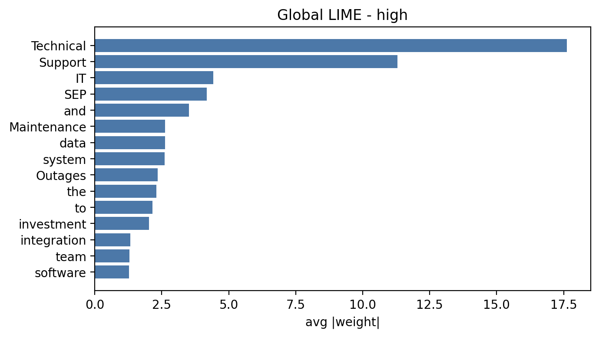
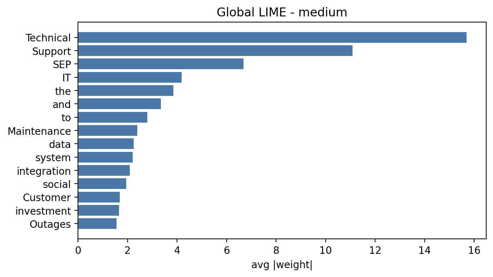
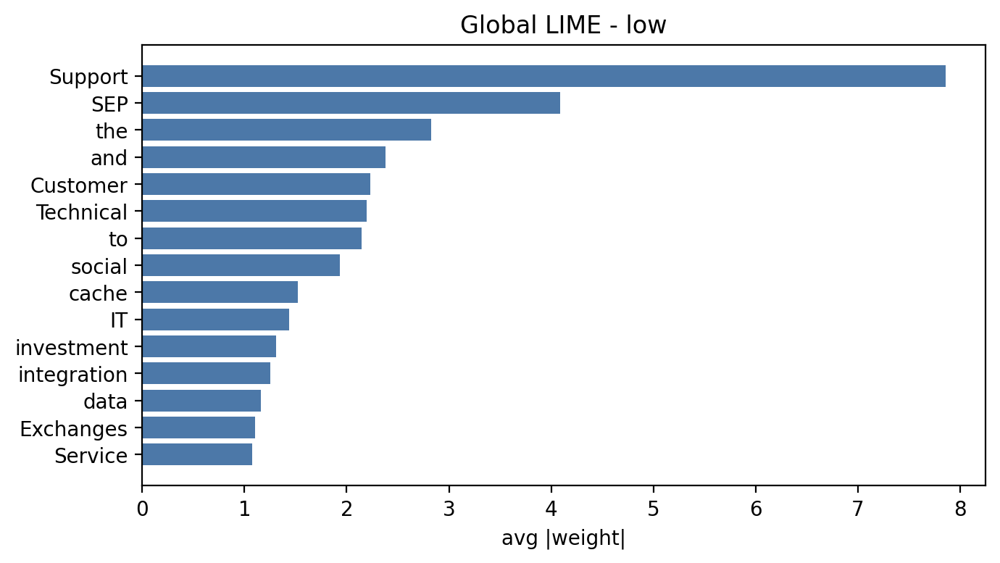
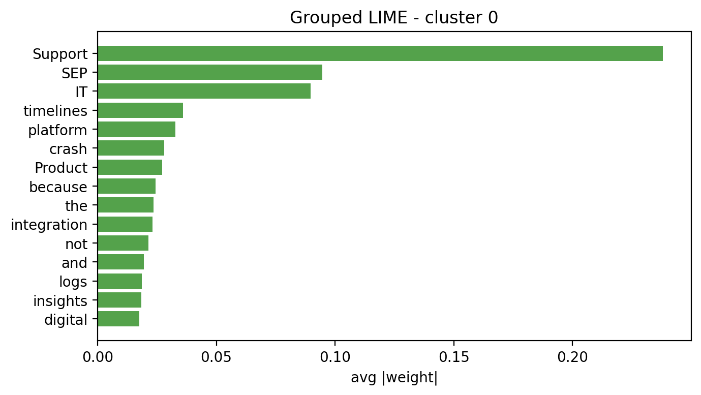
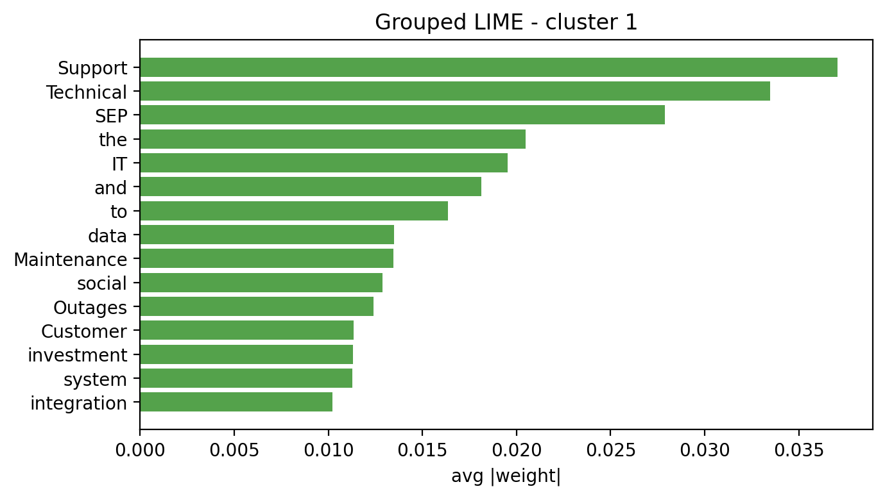
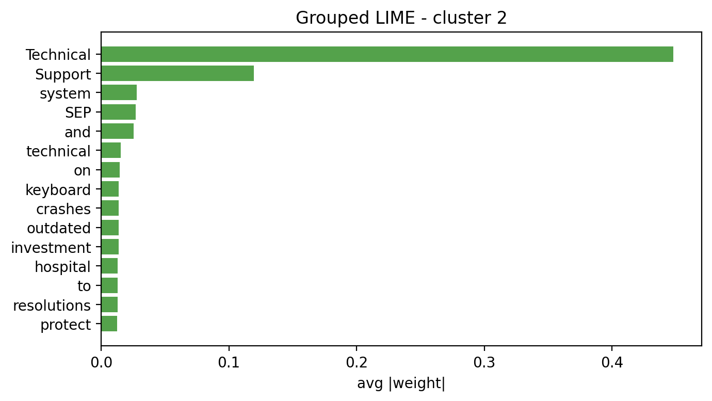
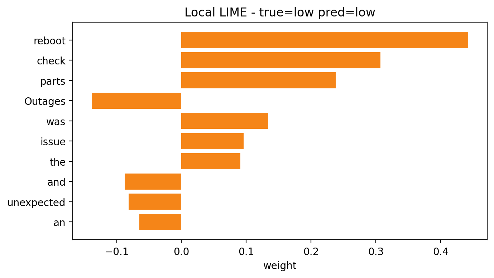

# Ticket Priority Classification (TFM)

Proyecto end-to-end de clasificacion de tickets de soporte en High/Medium/Low con NLP + metadatos y metricas de negocio (SLA/tiempos), alineado con el Proyecto 1 del enunciado: Modelizacion Predictiva y Metricas de Negocio.

Este trabajo parte de un dataset realista de tickets de soporte y persigue un objetivo de negocio claro: priorizar incidencias para mejorar la puntualidad frente a los SLA. A partir de ese objetivo se construye un pipeline completo, se comparan modelos y se traducen las metricas tecnicas a impacto empresarial.

Dataset original en Kaggle: https://www.kaggle.com/datasets/parthpatil256/it-support-ticket-data?resource=download
Se eligio por su estructura realista (texto libre + metadatos operativos), similar a un sistema real de soporte IT.

## TL;DR
- Problema: clasificacion supervisada de prioridad de tickets (High/Medium/Low).
- Mejor modelo (actual): SetFit (F1_macro 0.755, Recall High 0.777).
- Impacto negocio (modo simple): mean_gap 1.15h vs 3.21h aleatorio; acc 73.61%.
- Pipeline reproducible con metricas tecnicas y de negocio.

## Objetivo de negocio
Reducir violaciones de SLA y desfases de atencion priorizando correctamente tickets. El modelo debe identificar de forma fiable los casos High para acelerar el triaje y mejorar la puntualidad del servicio.

## Resumen del enfoque
Se construyo un pipeline reproducible que limpia datos, crea features (texto + metadatos), compara familias de modelos y traduce el rendimiento tecnico a impacto de negocio. La eleccion del modelo final se basa en F1_macro y recall de High, ya que este ultimo reduce desfases frente a los SLA.

## Hilo conductor del proyecto
El flujo sigue una narrativa unica: objetivo de negocio, datos, modelos, evaluacion, explicabilidad y despliegue conceptual. Cada seccion del README sigue este orden para mantener coherencia y trazabilidad.

## Tipo de problema
Se trata de un problema de clasificacion supervisada multiclase donde la variable objetivo es la prioridad del ticket (high/medium/low). Se elige este enfoque porque el objetivo es ordenar tickets por urgencia operativa.

## Datos
- Fuente: `data/raw/data.csv`.
- Variables clave: `Body` (texto), `Department` (categoria), `Tags` (lista), `Priority` (target).
- Tamano tras limpieza: ~29.6k registros.

### Limpieza y transformaciones
- Eliminacion de columnas `Unnamed` y normalizacion de `Priority` a lower.
- Relleno de vacios: `Body` -> "" (cadena vacia), `Department` -> "Unknown" (y `str.strip()`).
- Filtro de prioridades fuera de {low, medium, high} y textos vacios.
- Features numericas derivadas: `n_tags` y `len_words`.
- Split 80/20 estratificado (`SEED=42`).

## EDA
Se genera en `reports/eda_report.json` y `reports/figures/`:
- Distribucion de clases (desbalanceo moderado).
- Longitud de texto y numero de tags.
- Top departamentos y tags.
- Correlaciones numericas.

## Modelos probados y justificacion
1) **TF-IDF + OHE + numericas** (LogReg / Linear SVM / NB) como baseline clasico, rapido y explicable.
   - TF-IDF con n-gramas (1-2), `min_df=2` y `sublinear_tf`.
   - OHE de `Department` + numericas (`n_tags`, `len_words`).
   - Comparativa por CV en `reports/metrics_baselines.json`.
   - Baseline cerrado y auditado en `README_TFIDF_OHE_FINAL_AUDIT.md`.
2) **Embeddings + modelos lineales** (sentence-transformers) para capturar semantica mas densa.
   - Estrategias `body_dept_concat`, `body_dept_avg`, `body_dept_concat_num`.
   - Resultados en `reports/experiments/*.json`.
3) **SetFit (fine-tuning)** con `all-MiniLM-L6-v2` para mejorar rendimiento en texto.
   - Metricas en `reports/metrics_setfit.json`.
4) **Zero-shot** con LLM local (Ollama + deepseek-r1:8b) para benchmark sin entrenamiento.
   - Metricas en `reports/metrics_zero_shot.json`.

## Metricas tecnicas
### Manejo del desbalance
Se evita el submuestreo sistematico porque reduce informacion y puede empeorar la generalizacion. En su lugar:
- Se mantiene el dataset completo y se usa **split estratificado**.
- En modelos lineales se aplica `class_weight="balanced"` para penalizar mas los errores en la clase minoritaria.
- En SetFit se puede activar **oversampling solo de la clase minoritaria** (`SETFIT_BALANCE_MODE=oversample`) si se quiere equilibrar el entrenamiento sin recortar clases mayoritarias.
- **Downsample** es una alternativa experimental (`SETFIT_BALANCE_MODE=downsample`), pero reduce datos y se usa solo si se prioriza igualdad entre clases.

Metrica principal: **F1_macro** (por desbalanceo). Tambien se reportan **accuracy** y **precision/recall** por clase, con foco en **recall High** por su impacto en SLA. Los baselines se validan con CV estratificada y el modelo final se evalua en test.

### Resumen comparativo de metricas

| Modelo | Configuracion | Evaluacion | Accuracy | F1_macro | Recall High |
|---|---|---:|---:|---:|---:|
| TF-IDF + OHE + num | Linear SVM (baseline) | CV (train) | - | 0.706 | - |
| TF-IDF + OHE + num | Mejor modelo (test) | Test | 0.672 | 0.661 | 0.729 |
| Embeddings | mpnet + concat num + LogReg C=2.0 | Test | - | 0.509 | 0.616 |
| SetFit | all-MiniLM-L6-v2 (train 16k) | Test | 0.765 | 0.755 | 0.777 |
| Zero-shot | deepseek-r1:8b (Ollama, n=100) | Test | 0.390 | 0.320 | 0.463 |

### Detalle por familia (todas las combinaciones)
A continuacion se listan las combinaciones probadas por familia para mantener un historico reproducible y justificar la eleccion final.

### Guia de parametros en las tablas
- **Accuracy**: porcentaje total de aciertos.
- **F1_macro**: media no ponderada del F1 por clase (clave con desbalanceo).
- **Recall High**: sensibilidad en la clase High (impacta directamente en SLA).
- **CV F1_macro**: F1_macro promedio en validacion cruzada.
- **C**: regularizacion del clasificador (LogReg/SVM), mayor C = menos regularizacion.
- **Estrategia**: forma de construir features (p.ej., `body_dept_concat_num`).
- **FAST_MODE**: si se entreno en modo rapido (menos epochs/iteraciones).

### Estrategias de embeddings (por que probar varias)
Se probaron tres estrategias porque cada una combina senales distintas y puede capturar mejor la prioridad:
- **body_dept_concat**: concatena embedding del texto + embedding del departamento. Util si el departamento aporta contexto operativo.
- **body_dept_avg**: promedio de embeddings de texto y departamento. Reduce dimension y ruido, pero puede perder matices.
- **body_dept_concat_num**: concatena texto + departamento + numericas (`n_tags`, `len_words`). Suele rendir mejor al anadir senales estructuradas.

Probar varias permite medir el trade-off entre complejidad, coste y rendimiento.

### Estrategias de Department (OHE vs hash)
Se compararon distintas codificaciones de `Department` porque afecta al tamano del vector y al riesgo de sparsidad:
- **OHE completo**: todas las categorias como columnas. Viable porque solo hay ~10 departamentos.
- **OHE agrupado**: agrupa categorias infrecuentes (no aporta mejora con esta cardinalidad).
- **Hashing**: util si la cardinalidad creciera mucho; aqui no aporta ventaja.

El codigo compara las tres variantes y selecciona la mejor por macro-F1 en CV. Dada la baja cardinalidad, los resultados son muy similares y OHE completo suele ser suficiente.

<!-- COMBINATIONS_START -->
### Combinaciones probadas por familia

**TF-IDF (CV, F1_macro)**
| Modelo | F1_macro mean | F1_macro std |
|---|---|---|
| linear_svm | 0.706 | 0.004 |
| logreg | 0.645 | 0.003 |
| multinomial_nb | 0.413 | 0.004 |

**TF-IDF (test del mejor modelo)**
| Modelo | Accuracy | F1_macro | Recall High |
|---|---|---|---|
| best_tfidf_model | 0.672 | 0.661 | 0.729 |

**Embeddings (test + CV)**
| Embedding | Estrategia | Clasificador | C | CV F1_macro | Test F1_macro | Recall High |
|---|---|---|---|---|---|---|
| sentence-transformers/all-MiniLM-L6-v2 | body_dept_avg | linear_svm | 0.5 | 0.502 | 0.496 | 0.634 |
| sentence-transformers/all-mpnet-base-v2 | body_dept_avg | linear_svm | 0.5 | 0.510 | 0.518 | 0.636 |
| sentence-transformers/all-MiniLM-L6-v2 | body_dept_avg | linear_svm | 1.0 | 0.503 | 0.499 | 0.637 |
| sentence-transformers/all-mpnet-base-v2 | body_dept_avg | linear_svm | 1.0 | 0.516 | 0.516 | 0.636 |
| sentence-transformers/all-MiniLM-L6-v2 | body_dept_avg | linear_svm | 2.0 | 0.503 | 0.504 | 0.639 |
| sentence-transformers/all-mpnet-base-v2 | body_dept_avg | linear_svm | 2.0 | 0.517 | 0.519 | 0.630 |
| sentence-transformers/all-MiniLM-L6-v2 | body_dept_concat | linear_svm | 0.5 | 0.503 | 0.506 | 0.643 |
| sentence-transformers/all-mpnet-base-v2 | body_dept_concat | linear_svm | 0.5 | 0.517 | 0.522 | 0.639 |
| sentence-transformers/all-MiniLM-L6-v2 | body_dept_concat | linear_svm | 1.0 | 0.503 | 0.508 | 0.639 |
| sentence-transformers/all-mpnet-base-v2 | body_dept_concat | linear_svm | 1.0 | 0.523 | 0.524 | 0.638 |
| sentence-transformers/all-MiniLM-L6-v2 | body_dept_concat | linear_svm | 2.0 | 0.503 | 0.511 | 0.638 |
| sentence-transformers/all-mpnet-base-v2 | body_dept_concat | linear_svm | 2.0 | 0.524 | 0.524 | 0.636 |
| sentence-transformers/all-MiniLM-L6-v2 | body_dept_concat_num | linear_svm | 0.5 | 0.504 | 0.507 | 0.643 |
| sentence-transformers/all-mpnet-base-v2 | body_dept_concat_num | linear_svm | 0.5 | 0.516 | 0.521 | 0.636 |
| sentence-transformers/all-MiniLM-L6-v2 | body_dept_concat_num | linear_svm | 1.0 | 0.504 | 0.510 | 0.641 |
| sentence-transformers/all-mpnet-base-v2 | body_dept_concat_num | linear_svm | 1.0 | 0.522 | 0.524 | 0.638 |
| sentence-transformers/all-MiniLM-L6-v2 | body_dept_concat_num | linear_svm | 2.0 | 0.505 | 0.511 | 0.638 |
| sentence-transformers/all-mpnet-base-v2 | body_dept_concat_num | linear_svm | 2.0 | 0.525 | 0.525 | 0.636 |
| sentence-transformers/all-MiniLM-L6-v2 | body_dept_concat | logreg | 0.5 | 0.499 | 0.501 | 0.629 |
| sentence-transformers/all-mpnet-base-v2 | body_dept_concat | logreg | 0.5 | 0.504 | 0.507 | 0.624 |
| sentence-transformers/all-MiniLM-L6-v2 | body_dept_concat | logreg | 1.0 | 0.499 | 0.502 | 0.627 |
| sentence-transformers/all-mpnet-base-v2 | body_dept_concat | logreg | 1.0 | 0.508 | 0.511 | 0.622 |
| sentence-transformers/all-MiniLM-L6-v2 | body_dept_concat | logreg | 2.0 | 0.499 | 0.503 | 0.623 |
| sentence-transformers/all-mpnet-base-v2 | body_dept_concat | logreg | 2.0 | 0.511 | 0.510 | 0.619 |
| sentence-transformers/all-MiniLM-L6-v2 | body_dept_concat_num | logreg | 0.5 | 0.497 | 0.500 | 0.631 |
| sentence-transformers/all-mpnet-base-v2 | body_dept_concat_num | logreg | 0.5 | 0.505 | 0.505 | 0.622 |
| sentence-transformers/all-MiniLM-L6-v2 | body_dept_concat_num | logreg | 1.0 | 0.500 | 0.502 | 0.631 |
| sentence-transformers/all-mpnet-base-v2 | body_dept_concat_num | logreg | 1.0 | 0.508 | 0.510 | 0.622 |
| sentence-transformers/all-MiniLM-L6-v2 | body_dept_concat_num | logreg | 2.0 | 0.501 | 0.503 | 0.625 |
| sentence-transformers/all-mpnet-base-v2 | body_dept_concat_num | logreg | 2.0 | 0.509 | 0.509 | 0.616 |

**SetFit**
| Modelo base | Balance mode | Train samples | Accuracy | F1_macro | Recall High | Recall Low |
|---|---|---:|---:|---:|---:|---:|
| sentence-transformers/all-MiniLM-L6-v2 | none | 16000 | 0.765 | 0.755 | 0.777 | 0.645 |
| sentence-transformers/all-MiniLM-L6-v2 | oversample | 16000 | 0.744 | 0.739 | 0.749 | 0.670 |
| sentence-transformers/all-MiniLM-L6-v2 | downsample | 14430 | 0.736 | 0.737 | 0.714 | 0.743 |

**Zero-shot**
| Proveedor | Modelo | N ejemplos | N eval | Accuracy | F1_macro | Recall High |
|---|---|---|---|---|---|---|
| ollama | deepseek-r1:8b | 5 | 100 | 0.390 | 0.320 | 0.463 |
<!-- COMBINATIONS_END -->

### Top-1 por familia (plantilla editable)
| Familia | Configuracion elegida | Motivo |
|---|---|---|
| TF-IDF | Linear SVM | Mejor F1_macro en CV |
| Embeddings | mpnet + concat num + LogReg C=2.0 | Mejor F1_macro en test de la familia |
| SetFit | all-MiniLM-L6-v2 (none) | Mejor rendimiento global en test |
| Zero-shot | deepseek-r1:8b (Ollama) | Benchmark local sin entrenamiento |

Archivos de metricas:
- Baselines CV: `reports/metrics_baselines.json`
- Test TF-IDF: `reports/metrics_test.json`
- Embeddings: `reports/experiments/embeddings_summary.csv`
- SetFit: `reports/metrics_setfit.json`
- Zero-shot: `reports/metrics_zero_shot.json`

### Eleccion del modelo
El mejor rendimiento en test es **SetFit (none)** (F1_macro 0.755, accuracy 0.765 y mejor recall en High). Por tanto, es el candidato principal para explicabilidad y despliegue. El modelo TF-IDF es la alternativa mas interpretable con menor coste.

### Eleccion segun objetivo (SetFit balance modes)
- **Objetivo SLA (priorizar High)**: el modo `none` mantiene el mejor recall High (0.777) y el mejor F1_macro (0.755). Es el candidato principal si el coste por fallos en High es alto.
- **Objetivo de igualdad entre clases**: el modo `downsample` sube el recall Low (0.743) a cambio de bajar recall High (0.714) y F1_macro (0.737). Se elige si se busca equilibrio y no solo SLA.
- **Compromiso intermedio**: `oversample` mejora Low (0.670) con menor caida de High (0.749), pero no supera al baseline en F1_macro.

## Metricas de negocio
El objetivo no es solo clasificar, sino acercar la prioridad predicha a la prioridad real y reducir el desfase de atencion respecto a los SLA. La utilidad se evalua con un modo simple que compara el gap en horas frente a un baseline aleatorio.

### Escenario de negocio (ejemplo)
Un equipo recibe tickets con distinta urgencia. Si un ticket High se atiende tarde, la empresa incumple el SLA y aumenta el impacto operativo. El modelo recomienda prioridad en tiempo real y permite:
- Identificar antes los casos High para acelerar el triaje.
- Reducir los desfases de atencion en los tickets criticos.
- Liberar tiempo del equipo evitando re-triaje manual.

En este contexto, **recall High** es la metrica clave: cuanto mayor sea, mas casos criticos se detectan a tiempo.

### Simulacion de impacto
En el README se usa el **modo simple** de `src/business_metrics.py`, pensado para una lectura rapida:
- Se asigna un tiempo objetivo fijo por prioridad (High=4h, Medium=8h, Low=12h).
- Se compara el **desfase en horas** entre la prioridad real y la prioridad predicha.
- Se incluye un baseline aleatorio con la misma distribucion de clases.

Este modo evita supuestos de colas o costes y deja claro si el modelo se acerca mas a la prioridad real que una asignacion aleatoria.

## Resultados de negocio (simulacion)
Definiciones (modo simple):
- **mean_gap**: horas medias de diferencia entre el tiempo objetivo real y el predicho.
- **median_gap**: mediana de esa diferencia.
- **acc**: porcentaje de tickets con prioridad predicha exactamente igual a la real.

Para resultados reproducibles en modo simple:
```
BUSINESS_MODE=simple BUSINESS_SEED=42 python -m src.business_metrics
```

Ultima ejecucion (SetFit, seed 42):
- Modelo: mean_gap **1.15h**, median_gap **0.00h**, acc **73.61%**
- Aleatorio: mean_gap **3.21h**, median_gap **4.00h**, acc **35.72%**

Interpretacion: el modelo es util si reduce `mean_gap` y mejora la `acc` frente al baseline aleatorio.

## Explicabilidad (LIME sobre el modelo final)
Se incluye un script de explicabilidad con LIME sobre SetFit:
- **Global**: top tokens por clase agregados (`reports/figures/explain_global_<label>.png`).
- **Local**: ejemplos individuales con contribuciones (`reports/explainability/local_*.html` y `.png`).
- **Agrupada**: clusters de explicaciones con tokens comunes (`reports/figures/explain_group_<k>.png`).

Ejecuta:
```
python -m src.explainability
```

Se genera `reports/explainability_summary.json` con el resumen global/local/agrupado.

### Variables influyentes (resumen)
A partir de LIME global:
- **High**: terminos asociados a incidencias tecnicas y operativas (p.ej., "Technical", "Support", "IT", "Maintenance", "Outages", "system").
- **Medium**: vocabulario tecnico general y mantenimiento (p.ej., "Technical/Support", "IT", "Maintenance", "system", "integration").
- **Low**: vocabulario mas generico/servicio (p.ej., "Customer", "Service", "social", "cache").

En explicabilidad agrupada aparecen clusters coherentes con patrones de tickets (incidentologia tecnica, mantenimiento recurrente, hardware/software especifico).

### Ejemplos visuales de explicabilidad
A continuacion se muestran ejemplos directos de las explicaciones generadas para que cualquier lector pueda interpretar por que el modelo decide una prioridad u otra.

**Interpretacion de las graficas**
Las graficas globales muestran los tokens con mayor peso promedio por clase. En High aparecen terminos ligados a incidencias tecnicas y operativas, mientras que en Low predomina vocabulario mas orientado a servicio o consultas generales. Esto explica por que el modelo eleva la prioridad cuando detecta palabras asociadas a fallos, interrupciones o mantenimiento.

En las graficas agrupadas, cada cluster resume un tipo de ticket con patrones comunes (p.ej., incidencias tecnicas recurrentes, problemas de software o casos mas administrativos). Esto permite explicar decisiones por segmentos y no solo caso a caso.

Las graficas locales muestran un ejemplo concreto: se ve que tokens especificos empujan la prediccion hacia una prioridad. Esto permite explicar cada prediccion individual sin ejecutar el script.

**Global (tokens mas influyentes por clase)**
- High:



- Medium:



- Low:



**Agrupada (clusters de explicaciones)**







**Local (ejemplo individual)**




## Dificultades y como se resolvieron
- **Entrenamiento SetFit**: el primer entrenamiento completo fue terminado por el sistema (proceso "killed"). Se resolvio limitando el tamano de entrenamiento con `SETFIT_MAX_TRAIN_SAMPLES` y ajustando el modo de ejecucion.
- **Explicabilidad**: el modelo SetFit guardaba etiquetas numericas (0/1/2). Se corrigio el mapeo para mostrar etiquetas de negocio (high/low/medium) y generar explicaciones locales coherentes.
- **Zero-shot**: rendimiento significativamente inferior al modelo entrenado; se documento como benchmark de referencia y no como candidato final.

## Limitaciones
- El dataset no incluye dimension temporal, por lo que no se evalua concept drift real.
- La simulacion simple usa tiempos objetivo fijos por prioridad y no modela colas ni capacidad real.
- No hay feedback humano en produccion (no se evalua ciclo de mejora continua).

## Despliegue conceptual
### Cadencia propuesta
- **Cadencia**: retraining mensual o cuando los criterios de degradacion se cumplan.

### Criterios de retraining y drift
- **Retraining**: definir umbrales internos (p.ej., caida sostenida de F1_macro/recall High) y reentrenar cuando se superen.
- **Drift**: monitorizar cambios en distribucion de texto (longitud, vocabulario, OOV) y metadatos (`Department`, `n_tags`).
- **Validacion**: comparar metricas offline en un holdout temporal antes de promover el modelo.

### Propuesta de produccion
- **Tipo**: API en tiempo real para priorizacion inmediata (`FastAPI`).
- **Monitorizacion**: dashboard con metricas tecnicas, distribucion de clases, latencia y alertas de data drift.
- **Versionado**: versionar modelo, vectorizadores/config y datos; estrategia de rollback.

### Estrategia de actualizacion de features
- **Pipeline versionado**: versionar transformaciones y vocabularios (TF-IDF/embeddings) junto con el modelo.
- **Compatibilidad**: mantener compatibilidad hacia atras o migrar con un reentrenamiento completo.
- **Validacion previa**: comparar metricas en un holdout temporal antes de desplegar la nueva version.

### Herramientas propuestas
- **API/servicio**: FastAPI + Uvicorn.
- **Batch/retraining**: cron o Airflow.
- **Tracking/registro**: MLflow o Weights & Biases (propuesta).
- **Despliegue**: Docker para empaquetado y versionado del servicio.

## Pipeline (esquema textual)
Ingesta (CSV) -> Limpieza -> Feature engineering -> Split -> Entrenamiento -> Evaluacion -> Metricas negocio -> API

## Estructura del repo
- `data/raw/`, `data/processed/`
- `src/` (data prep, EDA, entrenamiento, evaluacion, metricas negocio, API, explicabilidad)
- `models/` (modelos serializados)
- `reports/` (metricas, figuras, experimentos, explicabilidad)

## Uso rapido (Linux)
```
python3 -m venv .venv
source .venv/bin/activate
pip install -r requirements.txt
python -m src.data_prep
python -m src.eda
python -m src.train
python -m src.evaluate
python -m src.business_metrics
uvicorn src.serve_api:app --reload
```

### Benchmarks adicionales
- Embeddings:
```
python -m src.train.embeddings_experiments
```
- SetFit:
```
python -m src.train.deep_setfit
```
- Zero-shot (Ollama):
```
ZERO_SHOT_PROVIDER=ollama OLLAMA_MODEL=deepseek-r1:8b ZERO_SHOT_N_EXAMPLES=5 ZERO_SHOT_N_EVAL=100 python -m src.train.zero_shot
```

## Conclusiones
- SetFit mejora de forma clara el rendimiento frente a baselines clasicos y zero-shot.
- El recall de High es alto, lo que impacta directamente en la reduccion de violaciones SLA.
- Se dispone de pipeline reproducible y metricas tecnicas/negocio para justificar la solucion.

## Mejoras futuras
- TF-IDF: revisar metricas usadas (macro-F1, recall High, confusion matrix) y justificar su relevancia para SLA.
- TF-IDF: comparar OHE full vs OHE agrupado vs hashing para validar que el full es suficiente con baja cardinalidad.
- EDA: mantener el analisis centrado en variables originales y dejar features numericas solo para modelos.
- Embeddings: probar mas modelos base (MiniLM, MPNet, distilroberta) y comparar rendimiento vs coste/latencia de inferencia.
- Embeddings: ponderar Body/Department en el embedding (50/50, 70/30, 30/70) para validar el peso informativo de cada campo.
- SetFit: probar mas modelos base y elegir el mejor tras las pruebas de embeddings.
- SetFit: usar split 70/20/10 (train/val/test) para seleccionar el modelo final en lugar de CV.
- SetFit: ampliar metricas reportadas y justificar su eleccion (macro-F1, recall High, confusion matrix).
- SetFit: variar hiperparametros (epochs, batch size, learning rate, FAST_MODE) para cubrir mas combinaciones.
- Zero-shot: probar mas modelos (p.ej., Gemini 2.5 Flash Lite) y varios prompts para evaluar sensibilidad.
- Zero-shot: variar numero de ejemplos (few-shot) y comparar impacto en metricas.
- Zero-shot: revisar metricas reportadas y justificar su relevancia.
- Validacion: implementar split 70/20/10 real y documentar resultados, y justificar CV vs hold-out segun familia.
- Metricas: reportar matriz de confusion y metricas por clase en todas las familias.
- Metricas: medir latencia/tiempo de inferencia por familia para justificar decisiones.
- Analisis de errores: ejemplos tipicos de confusion High/Medium para explicar limites del modelo.
- Tuning sistematico y balanceo (SMOTE/RandomOverSampler).
- Visualizaciones de negocio y sensibilidad de ahorro.
- Monitorizacion y versionado automatizados en un entorno real.


## Cosas pendientes para cerrar
- TF-IDF: ejecutar los scripts para sacar metricas, revisar Chat-GPT y consultar con Codex

