# 📊 Ticket Priority Classification
Proyecto de clasificación automática de tickets de soporte IT en prioridades **high / medium / low**, combinando NLP, metadatos operativos y métricas de negocio (SLA / coste).

---

## 1. Introducción y contexto del problema

### 1.1 Contexto de negocio
Un sistema de soporte IT gestiona incidencias mediante tickets con información textual y metadatos. Una mala priorización provoca tiempos de respuesta inadecuados, sobrecarga del equipo de soporte y riesgo de incumplimiento de SLA (Acuerdo de Nivel de Servicio).

En este contexto, **no todos los errores tienen el mismo impacto**: fallar un ticket `High` es mucho más costoso que confundir un `Low`. Por tanto, el problema no puede evaluarse únicamente con métricas globales.

### 1.2 Objetivo de negocio
Objetivo principal: **reducir violaciones de SLA** priorizando correctamente los tickets, teniendo más importancia la correcta clasificación de aquellos que sean críticos (`High`).  
Objetivos secundarios:
- Reducir ruido operativo.
- Mejorar el triaje inicial.
- Disminuir el coste asociado a errores graves de priorización.

Este objetivo se aborda mediante un **sistema de clasificación supervisada**, entrenado con datos históricos de tickets.

---

## 2. Definición del problema de Machine Learning

### 2.1 Tipo de problema
Clasificación supervisada multiclase (`high`, `medium`, `low`).

- No es regresión: las clases no representan un valor continuo.
- No se trata como ordinal puro: aunque hay orden (low < medium < high), el coste del error no es lineal ni simétrico (fallar un `high` es mucho más grave).
- Cada clase tiene un peso de negocio distinto.

### 2.2 Variable objetivo
`Priority` define la urgencia del ticket:
- `high`: impacto crítico.
- `medium`: impacto moderado.
- `low`: consultas o mejoras.

La clase **High** es prioritaria aunque no sea la más abundante, porque es la que más impacta en SLA.

---

## 3. Datos y preparación

### 3.1 Fuente de datos
Dataset público de Kaggle (tickets de soporte IT).

- Registros totales: **29 651**
- Variables principales: `Body`, `Department`, `Tags`, `Priority`

### 3.2 Distribución de clases

| Clase | Nº tickets | % |
|------|------------|---|
| High | 11 512 | 38.8 |
| Medium | 12 126 | 40.9 |
| Low | 6 013 | 20.3 |

### 3.3 Exploración inicial del dataset
- Desbalance moderado: la clase `Low` es aproximadamente la mitad de `High/Medium`.
- Texto libre con señales operativas claras.
- Cardinalidad moderada en `Department`.

**Figura 3.1 — Distribución de prioridades**  
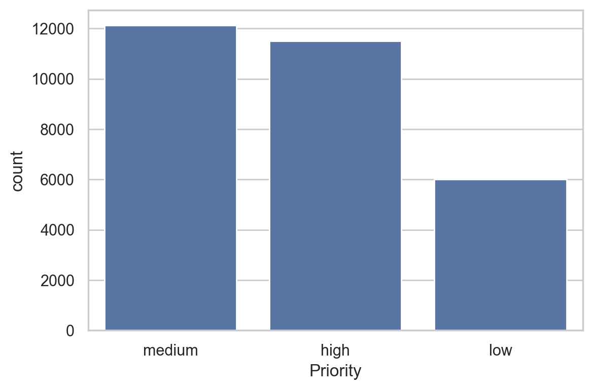

**Figura 3.2 — Departamentos más frecuentes**  
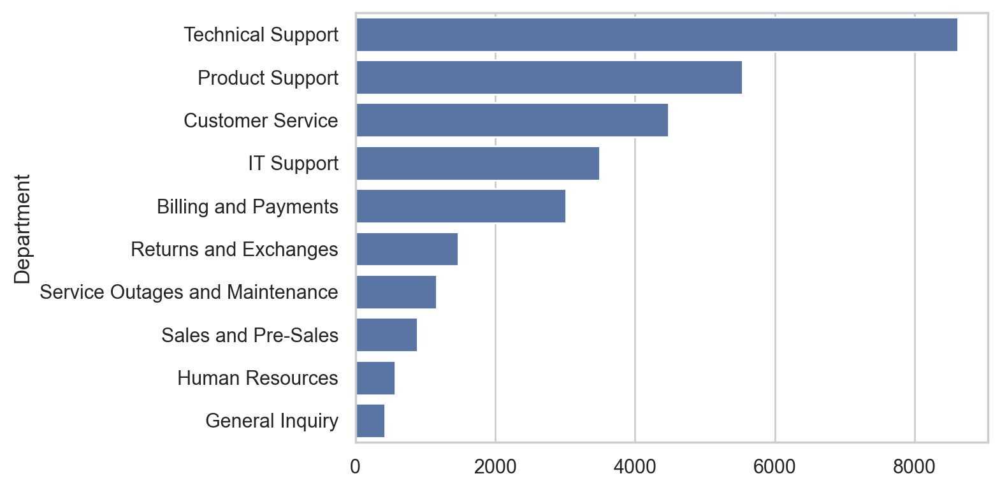

**Figura 3.3 — Longitud del texto por clase**  
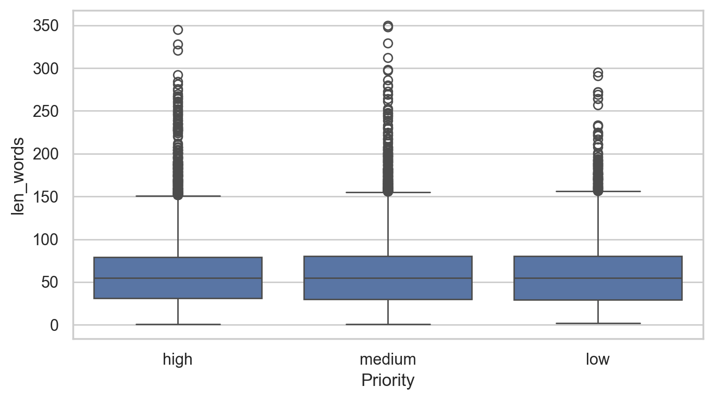

### 3.4 Limpieza y feature engineering
- Normalización de `Priority` a minúsculas.
- `Body` vacío → cadena vacía.
- `Department` nulo → `"Unknown"`.
- `Tags` parseado a lista.
- Variables derivadas: `n_tags`, `len_words`.

Estas variables combinan **señal semántica** y **contexto operativo**, alineadas con el problema real.

---

## 4. Hipótesis de partida y estrategia experimental

### 4.1 Hipótesis de partida
- TF-IDF + modelos clásicos puede ser altamente competitivo.
- Los embeddings capturan semántica más rica, pero no siempre compensan en datasets medianos.
- SetFit permite fine-tuning eficiente sin modelos grandes.
- Zero-shot sirve como benchmark, no como solución final.

### 4.2 Estrategia de comparación
Se comparan **familias de modelos**, no solo configuraciones individuales:
- TF-IDF + modelos clásicos.
- Embeddings + clasificadores lineales.
- Fine-tuning con SetFit.
- Zero-shot / Few-shot con LLMs.

“Ganar” significa maximizar el **recall de la clase `High`** (métrica primaria de negocio), manteniendo un buen equilibrio global entre clases medido mediante **macro-F1** (métrica técnica principal), con coste operativo razonable y trazabilidad.

---

## 5. Estrategia global de evaluación y métricas

### 5.1 Principios generales
- Separación entre selección y evaluación final.
- Robustez al desbalance.
- Priorización de errores con impacto real en SLA.
- Evitar métricas redundantes o poco interpretables.

La métrica principal debe reflejar el equilibrio entre clases y penalizar la pérdida de tickets críticos. Por eso se priorizan métricas por clase y promedios no ponderados frente a métricas agregadas dominadas por la clase mayoritaria.

### 5.2 Métricas técnicas principales

#### Macro-F1
- Promedio no ponderado del F1 por clase.
- Evita que la clase mayoritaria domine el resultado.
Se usa como métrica principal de comparación porque resume rendimiento global sin ocultar clases minoritarias.

#### Balanced Accuracy
- Promedio del recall por clase.
- Útil para detectar modelos que ignoran clases minoritarias.
Sirve como verificación de equilibrio entre clases, especialmente cuando accuracy puede parecer alto por la clase dominante.
La balanced accuracy se utiliza como métrica diagnóstica para validar el equilibrio entre clases, pero no como criterio principal de selección ni comparación final entre enfoques.

#### Métricas por clase (High)
- Precision (High)
- Recall (High)
- F1 (High)

Estas métricas conectan directamente con riesgo SLA.
En negocio, un falso negativo en `High` tiene un coste muy superior, por eso se monitoriza explícitamente el recall de la clase crítica.

### 5.3 Métricas complementarias
- Accuracy (solo como referencia).
- Weighted F1 (diagnóstico global).
Se reportan para contexto, pero no se optimizan porque pueden ocultar fallos en `High`.

### 5.4 Confusion Matrix
Permite cuantificar errores críticos:
- `High → Medium`
- `High → Low`
Es la forma más directa de traducir errores técnicos a impacto operativo.

### 5.5 Métricas descartadas
- ROC-AUC multiclase.
- Log-loss.
- MCC / Cohen’s Kappa.
Se descartan por baja interpretabilidad en negocio, dependencia de probabilidades calibradas y menor conexión directa con SLA.

### 5.6 Métricas de negocio y simulación de impacto

Las métricas de negocio se detallan en la sección 9 (objetivo, traducción a impacto y simulación).

---

## 6. Exploración de enfoques y resultados

### 6.1 TF-IDF + modelos clásicos (baseline principal)

#### Motivación del enfoque

Se establece como primer enfoque un baseline basado en **TF-IDF combinado con modelos lineales**, por tratarse de una solución:

- interpretable,
- computacionalmente eficiente,
- ampliamente utilizada como referencia en clasificación de texto.

Este enfoque permite además **analizar de forma clara los errores**, algo especialmente relevante cuando el impacto de negocio (SLA) no es simétrico entre clases.

---

#### ¿Qué es TF-IDF y por qué se utiliza?

TF-IDF (Term Frequency – Inverse Document Frequency) es una representación vectorial que pondera los términos según su frecuencia en un documento y su rareza en el corpus completo. De este modo, resalta palabras relevantes para un ticket concreto y reduce el peso de términos comunes.

Se utiliza en este proyecto por ser:
- altamente interpretable,
- eficaz en clasificación de texto con vocabulario técnico,
- un estándar sólido como baseline en problemas NLP supervisados.

---

#### Representación textual: TF-IDF

Se utiliza **TF-IDF a nivel de palabra** sobre el campo `Body`, que concentra la mayor parte de la señal semántica del ticket.

**Configuración final del vectorizador**
- n-grams: `(1, 2)`
- `min_df = 2`
- `sublinear_tf = True`
- `smooth_idf = True`

**Qué significa cada parámetro**
- `ngram_range=(1,2)`: usa unigramas y bigramas para capturar términos y expresiones frecuentes.
- `min_df=2`: descarta términos que aparecen en menos de 2 documentos, reduciendo ruido.
- `sublinear_tf=True`: aplica `1 + log(tf)` para evitar que palabras muy repetidas dominen el vector.
- `smooth_idf=True`: suaviza IDF para estabilizar pesos en términos raros.

Esta configuración busca capturar:
- términos individuales relevantes,
- expresiones operativas frecuentes (por ejemplo, *“service down”*, *“urgent issue”*),

sin introducir combinatoria excesiva ni ruido.

No se emplean:
- **stopwords personalizadas** (listas de palabras comunes a eliminar antes de vectorizar),
- **stemming / lemmatization** (reducir palabras a su raíz o lema, p. ej. “running” → “run”),
- **char n-grams** (n‑gramas a nivel de caracteres, útiles para variantes/typos pero con más dimensión y ruido),
- **selección de features (χ²)** (test para quedarte con términos más informativos).

Se dejan fuera para mantener **trazabilidad, estabilidad y control del espacio experimental**. Estas técnicas pueden aportar mejoras marginales, pero introducen más decisiones de preprocesado y dificultan la interpretación directa de los términos.

---

#### Incorporación de metadatos operativos

Además del texto, se incorporan señales estructurales relevantes:

- `Department`: variable categórica con cardinalidad baja (~10 valores).
- `n_tags`: número de etiquetas asociadas al ticket.
- `len_words`: longitud del texto del ticket.

Las variables numéricas se escalan mediante  
`StandardScaler(with_mean=False)` para compatibilidad con matrices dispersas.

##### Nota sobre el uso de `Tags`

Aunque el dataset incluye una columna `Tags`, estas no se incorporan directamente al TF-IDF como texto adicional. Los tags representan información categórica y altamente redundante con el contenido del `Body`, por lo que su inclusión directa podría introducir sesgos y doble conteo de señal semántica.

En su lugar, se utiliza `n_tags` como proxy de complejidad y grado de anotación del ticket, aportando señal adicional sin contaminar la representación textual.

---

#### Estrategias evaluadas para `Department`

Se comparan tres estrategias:
- One-Hot Encoding completo.
- One-Hot Encoding agrupado (frecuencias bajas).
- Hashing.

Resultados (macro-F1 en CV con **Linear SVM fijo**):
- **OHE completo**: 0.706 ± 0.004  
- **OHE agrupado**: 0.706 ± 0.004 
- **Hashing**: 0.706 ± 0.004  

Los resultados muestran **diferencias marginales** entre estrategias, coherentes con la baja cardinalidad de la variable.  
En este dataset, `Department` tiene pocas categorías y no hay clases raras con `min_freq=20`, por lo que **OHE agrupado ≈ OHE completo**.  
Además, con `n_hash=2048` las colisiones son despreciables, por eso **hashing reproduce prácticamente el mismo rendimiento**.
Para evitar decisiones arbitrarias y mantener coherencia con el pipeline, se adopta una **selección automática** de la mejor estrategia mediante **macro-F1 en validación cruzada**.
**Nota**: esta comparativa mantiene el modelo fijo y solo cambia la codificación de `Department`; por eso el macro-F1 puede coincidir con el valor del modelo base mostrado en la sección siguiente.

---

#### Modelos evaluados

Se entrenan y comparan los siguientes clasificadores:

- **Linear SVM**
- Logistic Regression
- Multinomial Naive Bayes

Todos los modelos se integran en un pipeline único que incluye:
- preprocesado,
- vectorización,
- clasificación.

Para SVM y Logistic Regression se utiliza  
`class_weight="balanced"`, priorizando la correcta detección de la clase `High`.
En Multinomial Naive Bayes no se aplica porque este estimador no soporta `class_weight`; se mantiene su ajuste estándar para comparar modelos de forma consistente sin introducir reponderaciones ad-hoc.

---

#### Estrategia de evaluación

##### División de datos
- Split **80 / 20** (train / test).
- Estratificación por `Priority`.
- El conjunto de test se mantiene **completamente aislado** hasta la evaluación final.

##### Justificación del uso de validación cruzada

La validación cruzada estratificada se utiliza para la selección de modelos y configuraciones por ofrecer una estimación más estable y robusta del rendimiento que un único conjunto de validación fijo.

En datasets desbalanceados, un split reducido puede contener pocos ejemplos de clases críticas, produciendo estimaciones inestables. La validación cruzada permite comparar modelos de forma justa, maximizar el uso de los datos disponibles y reducir la dependencia del azar.

El esquema 70/20/10 es válido cuando se requiere un conjunto de validación fijo (por ejemplo, en SetFit por coste y por la generación de pares); no se descarta para otros modelos si el método lo aconseja.  
En TF-IDF, al ser barato entrenar, se prioriza **CV sobre el 80%** y un **test más amplio (20%)** para obtener métricas finales y de negocio más estables. Mantener 70/20/10 además de CV sería redundante y reduciría el tamaño del test en este enfoque.

---

#### Resultados de selección (Cross-Validation)

Durante la validación cruzada estratificada sobre el conjunto de entrenamiento (con la mejor estrategia de `Department` seleccionada), se obtuvieron los siguientes resultados medios (macro-F1):

- **Linear SVM**: 0.706  
- **Logistic Regression**: 0.645  
- **Multinomial Naive Bayes**: 0.413  

La baja desviación estándar entre folds indica un comportamiento estable del pipeline y respalda la elección de **Linear SVM** como modelo base.
Estos valores son **medias de CV sobre el 80% de entrenamiento** y se usan únicamente para **selección de modelo**; no son directamente comparables con las métricas del test final.

---

#### Métricas utilizadas y justificación

##### Métrica principal (selección de modelo)
- **macro-F1**  
  Evalúa el equilibrio global entre clases sin favorecer a la mayoritaria.

##### Métricas de evaluación final (test)
- **macro-F1**
- **recall de la clase High**
- accuracy (solo como referencia)
- confusion matrix

El **recall High** es la métrica más relevante desde el punto de vista de negocio, ya que un falso negativo en esta clase implica riesgo directo de incumplimiento de SLA.

---

#### Artefactos y métricas generadas

Durante la experimentación se generan y almacenan artefactos intermedios para asegurar **trazabilidad y reproducibilidad**:

- Métricas de validación cruzada por modelo (`metrics_baselines.json`)
- Comparativa de estrategias de `Department` (`metrics_dept_strategies.json`)
- Métricas finales en conjunto de test (`metrics_test.json`)
- Matriz de confusión del modelo final

Durante la experimentación se registran métricas adicionales (por fold, por estrategia y métricas auxiliares) con fines diagnósticos. Estas no se incluyen en el documento final para evitar ruido experimental, pero permiten validar la estabilidad del pipeline y detectar comportamientos anómalos durante el desarrollo.

---

#### Resultados obtenidos (TF-IDF)

**Mejor configuración seleccionada**
- Modelo: **Linear SVM**
- Representación: TF-IDF + metadatos
- Estrategia de `Department`: **OHE completo** (empate entre estrategias; selección automática)

**Resultados en conjunto de test**
- Macro-F1 **0.762**
- Recall High **0.811**
- Accuracy **0.771**

Estas métricas se calculan en el **20% de test** con el modelo entrenado en todo el 80% de entrenamiento, por lo que pueden diferir de las medias de CV.

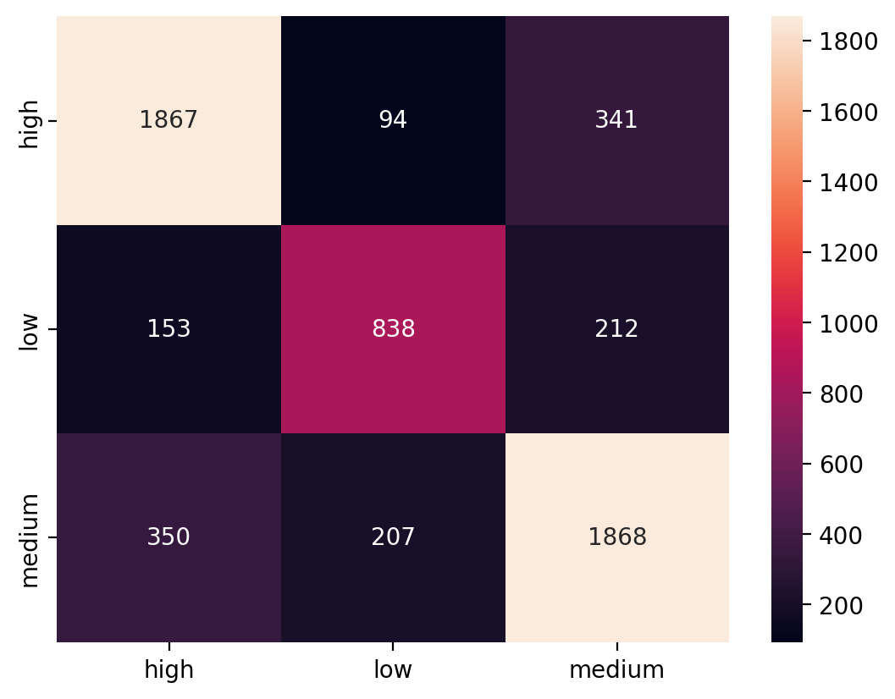

La matriz de confusión muestra que:
- la mayoría de errores de `High` se producen hacia `Medium`,
- los errores críticos `High → Low` son minoritarios.

Este patrón es coherente con el objetivo de negocio, ya que **prioriza no perder tickets críticos**, incluso a costa de cierta sobre-priorización.

---

#### Conclusión del enfoque TF-IDF

**Modelo seleccionado dentro del enfoque:**  
**TF-IDF + Linear SVM + metadatos operativos**

Esta configuración se selecciona por obtener el mejor equilibrio entre **macro-F1** y **recall de la clase High**, manteniendo una baja tasa de errores críticos (`High → Low`) y un coste computacional reducido.

El enfoque destaca por su **interpretabilidad, estabilidad y alineación directa con el objetivo de negocio**, consolidándose como el **baseline principal** del proyecto y la referencia frente a la que se comparan los enfoques posteriores.

Además de su rendimiento cuantitativo, el enfoque TF-IDF presenta una ventaja clave en entornos operativos: permite auditar y explicar las decisiones de priorización ante equipos de soporte. La interpretabilidad del modelo facilita la adopción del sistema, la detección de errores sistemáticos y la confianza en la automatización, factores críticos en escenarios donde el impacto de negocio no es simétrico.

#### Alcance experimental y decisiones descartadas

Durante el desarrollo del baseline TF-IDF se consideraron otras alternativas habituales en clasificación de texto, como:

- combinaciones híbridas TF-IDF + embeddings,
- ensembles o stacking de modelos,
- ajuste exhaustivo de hiperparámetros,
- ampliación de la representación textual a otros campos no estructurados.

Estas opciones se descartan de forma consciente en esta fase al priorizar:
- trazabilidad del pipeline,
- control del espacio experimental,
- interpretabilidad de las decisiones,
- y alineación directa con el objetivo de negocio.

El objetivo del baseline no es maximizar métricas a cualquier coste, sino establecer una referencia sólida, defendible y replicable sobre la que comparar enfoques más complejos.


---

### 6.2 Embeddings + clasificadores lineales

#### Motivación del enfoque

Aunque TF-IDF ofrece una representación eficaz y altamente interpretable, su naturaleza basada en frecuencia limita la captura de relaciones semánticas entre tickets redactados de forma distinta pero conceptualmente equivalentes.

El uso de **embeddings densos preentrenados** permite representar el texto en un espacio semántico continuo, donde:
- sinónimos y expresiones equivalentes quedan próximas,
- se reduce la dependencia del vocabulario exacto,
- se mejora la generalización ante variabilidad lingüística.

Este enfoque se evalúa como una **extensión natural del baseline**, manteniendo el **mismo tipo de clasificador (lineal)** para que el cambio principal sea la representación (embeddings) y no el modelo, asegurando comparabilidad, control experimental y trazabilidad.

---

#### Representación semántica mediante embeddings

Se emplean modelos *sentence-level embeddings* preentrenados, utilizados exclusivamente como **extractores de características**, sin fine-tuning del encoder.

No se realiza ajuste del encoder durante el entrenamiento con el objetivo de **aislar el efecto de la representación**, mantener la comparabilidad directa con TF-IDF y evitar introducir un coste computacional adicional que dificultaría la evaluación justa entre enfoques.

Modelos evaluados:
- `all-MiniLM-L6-v2` (ligero, baja latencia)
- `all-mpnet-base-v2` (mayor capacidad semántica)
- `all-distilroberta-v1` (punto intermedio)
- `multi-qa-MiniLM-L6-cos-v1` (orientado a recuperación semántica)

Para cada modelo se registran:
- dimensión del embedding,
- tiempo de inferencia,
- reutilización de caché,

permitiendo analizar el **trade-off rendimiento / coste computacional**.

---

#### Estrategias de combinación de features

Dado que el dataset combina texto libre y metadatos, se evalúan dos grandes familias de representación:

##### A) Embeddings “puros” (solo texto)

Se combinan embeddings de los campos textuales:
- `Body`
- `Department`
- `Tags`

Estrategias evaluadas:
- concatenación directa (`concat`)
- media normalizada (`avg`)
- medias ponderadas (`70/30`, `30/70`, `90/10`)

La normalización L2 previa garantiza comparabilidad entre vectores y evita sesgos de escala.

Nota: no se muestra un baseline explícito de *Body-only* en embeddings porque el **embedding del `Body` está presente en todas las variantes** y el objetivo aquí es medir el aporte incremental de `Department` y `Tags`. De este modo, la comparación se centra en si los campos auxiliares añaden señal semántica real frente a usar solo el texto principal.

Estas variantes permiten responder a:
> ¿Dónde reside la mayor parte de la señal semántica: en el texto libre o en los metadatos textuales?

Los experimentos muestran que la mayor parte de la señal semántica reside en el texto libre del ticket (`Body`). La incorporación de otros campos textuales no produce mejoras consistentes, lo que sugiere que el contenido descriptivo del ticket concentra la información más relevante para la tarea de clasificación.  
La inclusión de `Tags` como texto se evalúa de forma exploratoria para validar empíricamente si aportan señal semántica adicional; los resultados muestran que su contribución es limitada frente al texto libre (`Body`), por lo que se prioriza este último.  

Se evaluó el **grid completo de modelos y estrategias**, pero por claridad se muestra una única tabla representativa (un modelo base) para ilustrar las diferencias entre combinaciones.  

**Comparativa de estrategias (ejemplo: all-mpnet-base-v2, Linear SVM, C=2.0)**  
*`avg` = 50/50, `w30` = 30/70, `w70` = 70/30, `w90` = 90/10 (peso de `Body`/campo auxiliar).*

| Estrategia (Body + Dept) | Macro-F1 | Recall High |
|---|---:|---:|
| concat | 0.524 | 0.636 |
| avg | 0.519 | 0.630 |
| w30 | 0.518 | 0.636 |
| w70 | 0.520 | 0.637 |
| w90 | 0.512 | 0.621 |

| Estrategia (Body + Tags) | Macro-F1 | Recall High |
|---|---:|---:|
| concat | 0.489 | 0.579 |
| avg | 0.465 | 0.544 |
| w30 | 0.447 | 0.539 |
| w70 | 0.471 | 0.547 |
| w90 | 0.471 | 0.557 |

**Figura 6.2-A — Estrategias de combinación (solo texto, modelo seleccionado: all-mpnet-base-v2 + Linear SVM, C=2.0)**  
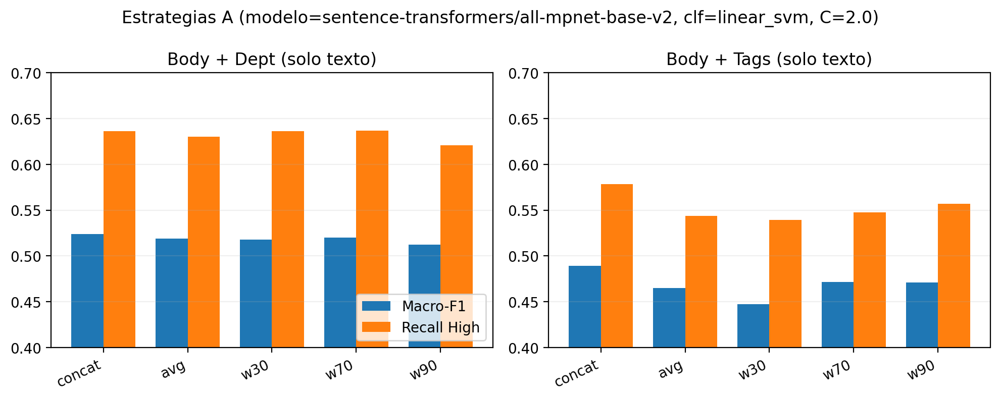
Interpretación: las medias ponderadas y la concatenación producen diferencias pequeñas y sin patrón consistente, confirmando que el peso relativo entre campos textuales tiene impacto limitado.

En ambos casos las diferencias son **marginales** y **no muestran un patrón consistente** que justifique una estrategia de media ponderada frente a concatenación.  
Revisando todo el grid en `reports/experiments/embeddings_summary.csv` (4 modelos × 2 clasificadores), el rango máximo observado al variar pesos es **<= 0.026 en macro-F1** y **<= 0.051 en recall High**. Por tanto, el impacto práctico de ajustar estos pesos es limitado.


---

##### B) Embeddings + estructura explícita (OHE)

El campo `Department` representa una **categoría funcional**, no lenguaje natural. Embeddizarlo puede introducir ruido semántico.

Por este motivo, se evalúa explícitamente `Department` tanto como embedding como mediante **One-Hot Encoding**, con el objetivo de validar empíricamente si su tratamiento como texto aporta información relevante o si, por el contrario, una codificación categórica explícita resulta más estable e interpretable.

La estrategia híbrida combina:
- Embedding del `Body` (y `Tags` cuando procede)
- `Department` codificado mediante **One-Hot Encoding**
- Variables numéricas (`n_tags`, `len_words`)

Esta aproximación separa explícitamente:
- **semántica** → embeddings
- **estructura del dominio** → OHE / numéricas

y permite analizar si esta distinción mejora estabilidad y rendimiento.

---

Se evaluó el **grid completo**, pero por claridad se muestra un ejemplo representativo para comparar *embedding de Department* vs **OHE**.  
**Ejemplo (all-mpnet-base-v2, Linear SVM, C=2.0):**

| Estrategia (Body + Dept) | Macro-F1 | Recall High |
|---|---:|---:|
| concat (Dept embebido) | 0.524 | 0.636 |
| concat + num | 0.525 | 0.636 |
| OHE + num | 0.525 | 0.636 |

| Estrategia (Body + Tags) | Macro-F1 | Recall High |
|---|---:|---:|
| concat (Tags embebidos) | 0.489 | 0.579 |
| Tags embebidos + Dept OHE + num | 0.526 | 0.650 |

**Figura 6.2-B — Estrategias con estructura explícita (OHE, modelo seleccionado: all-mpnet-base-v2 + Linear SVM, C=2.0)**  
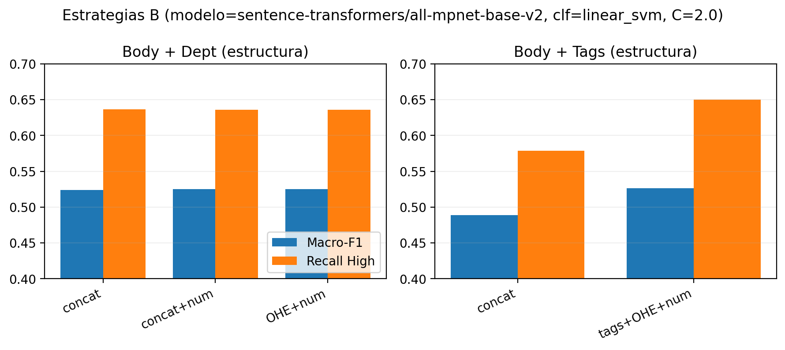
Interpretación: incorporar estructura explícita (OHE + numéricas) aporta una mejora moderada frente a embeddizar campos auxiliares sin estructura.

Estas métricas muestran que la **estructura explícita** (OHE + numéricas) aporta señal útil cuando se añaden campos auxiliares.  

**Resumen global del grid (4 modelos × 2 clasificadores; mejor C por CV):**
- *Body + Dept*: comparar **Dept embebido vs OHE + num** deja cambios **mínimos** (Δ macro-F1 media ≈ **+0.001**, rango **[-0.001, +0.002]**; Δ recall High media ≈ **-0.001**, rango **[-0.003, +0.001]**).
- *Body + Tags*: al añadir **OHE + num** se observa una mejora **consistente** (Δ macro-F1 media ≈ **+0.049**, rango **[+0.037, +0.059]**; Δ recall High media ≈ **+0.104**, rango **[+0.072, +0.129]**).

Esto indica que **OHE + numéricas** aporta señal estructural estable, mientras que embeddizar `Department` por sí solo no cambia de forma relevante el rendimiento.

#### Modelos de clasificación

Sobre las representaciones generadas se entrenan clasificadores lineales:
- **Linear SVM**
- Logistic Regression

Ambos se configuran con:
- `class_weight="balanced"`
- grid reducido de regularización (`C = {0.5, 1.0, 2.0}`)

La elección de modelos lineales responde a:
- control del sesgo,
- interpretabilidad,
- comparabilidad directa con TF-IDF.

---

#### Estrategia de evaluación

La evaluación sigue exactamente los mismos principios que el baseline TF-IDF:
- **Validación cruzada estratificada** para selección de modelo
- **Conjunto de test aislado** para evaluación final
- Misma partición y mismas métricas

La validación cruzada se emplea exclusivamente para la **selección de modelos y estrategias** sobre el conjunto de entrenamiento, mientras que el conjunto de test se mantiene completamente aislado y se utiliza únicamente para la **evaluación final y el cálculo de métricas orientadas a negocio**.

Esto garantiza que cualquier diferencia observada se deba a la **representación**, no al protocolo experimental.

---

#### Métricas específicas para embeddings

Además de las métricas generales (macro-F1, balanced accuracy), se introducen métricas orientadas a analizar el comportamiento del modelo sobre la clase crítica:

- **Average Precision (PR-AUC) High vs Rest**  
  Evalúa la capacidad del modelo como detector de tickets críticos en un escenario desbalanceado, permitiendo analizar el trade-off entre precisión y recall sin fijar un umbral concreto.

- **Distribución de predicciones por clase (`Pred High %`)**  
  Permite identificar patrones de sobre-priorización de la clase `High`, relevantes desde el punto de vista operativo.

Estas métricas permiten comparar configuraciones sin introducir aún métricas económicas explícitas, que se abordan de forma separada en la sección de métricas de negocio.


---

#### Resultados obtenidos

| Modelo de embeddings | Estrategia | C | Macro-F1 | Recall High | AP High | Pred High (%) |
|---------------------|------------|---:|----------|-------------|---------|---------------|
| all-MiniLM-L6-v2 | body_tags_ohe_num | 2.0 | 0.511 | 0.648 | 0.657 | 41.8 |
| all-distilroberta-v1 | body_ohe_num | 1.0 | 0.521 | 0.656 | 0.671 | 42.1 |
| all-mpnet-base-v2 | body_ohe_num | 2.0 | 0.525 | 0.636 | 0.673 | 40.7 |
| multi-qa-MiniLM-L6-cos-v1 | body_dept_concat | 1.0 | 0.511 | 0.643 | 0.650 | 41.6 |


Los resultados reflejan que, aunque existen diferencias entre encoders y estrategias de representación, **no se observa una mejora consistente respecto al baseline TF-IDF**, especialmente en métricas críticas como el recall de la clase High y el macro-F1, junto con un mayor coste computacional y complejidad del pipeline.

---

#### Criterio de selección y resumen de experimentos

La experimentación con embeddings genera **un fichero JSON por combinación** de:
- modelo de embeddings,
- estrategia de representación,
- clasificador,
- hiperparámetros.

Dado el elevado número de combinaciones evaluadas, **no se listan todos los experimentos**, sino que se adopta una estrategia de **resumen y selección justificada**, evitando ruido experimental y selección basada en resultados puntuales de test.

##### Información extraída de cada experimento

De cada archivo JSON se extraen las siguientes métricas:

**Selección (Cross-Validation):**
- `cv.f1_macro_mean`
- `cv.f1_macro_std`
- `cv.balanced_accuracy_mean` (si aplica)

**Evaluación final (test):**
- `test.macro_f1`
- `test.recall_high`
- `test.precision_high`
- `test.high_vs_rest_ap`
- `test.cost_per_ticket`
- errores `High → Medium` y `High → Low`

##### Selección del mejor experimento por modelo de embeddings

Para cada modelo de embeddings se selecciona **un único experimento representativo**, siguiendo este criterio:

1. Mayor `cv.f1_macro_mean`
2. Cumplimiento de un umbral mínimo de `test.recall_high`
3. En caso de empate:
   - mayor `test.high_vs_rest_ap`
   - mayor `test.recall_high`
   - menor desviación estándar en validación cruzada

Este enfoque prioriza **estabilidad, protección de la clase crítica e impacto de negocio**, evitando optimización directa sobre el conjunto de test.

---

#### Análisis de errores

El análisis de la matriz de confusión revela que:
- los errores de `High` tienden a confundirse con `Medium`,
- los errores críticos `High → Low` se mantienen bajos,
- no se observa una reducción significativa de estos errores frente al baseline.

Este patrón es consistente con los resultados métricos.

**Figura 6.2-C — Matriz de confusión (modelo embeddings seleccionado)**  
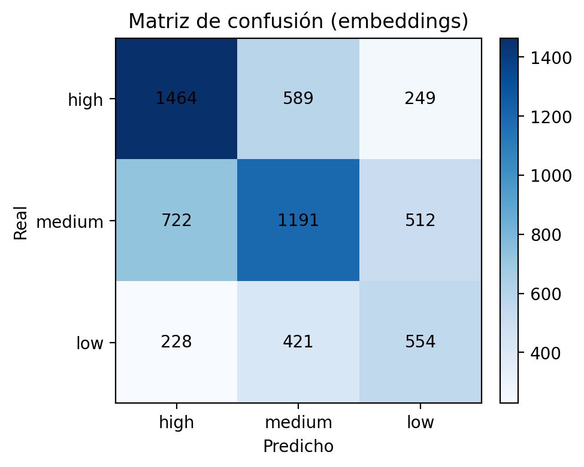

En el modelo seleccionado (`all-mpnet-base-v2 + body_ohe_num + Linear SVM, C=2.0`):
- `High → Medium`: **589** casos (~25.6% de los `High`)
- `High → Low`: **249** casos (~10.8% de los `High`)

Estos errores explican el *recall* de `High` (~0.636) y confirman que el patrón dominante sigue siendo la confusión con `Medium`, sin mejoras claras frente al baseline.

Dado el elevado número de combinaciones evaluadas, se prioriza una estrategia de selección basada en métricas alineadas con el objetivo del problema (macro-F1, recall High y estabilidad), evitando introducir métricas adicionales que no aporten información accionable ni modifiquen la decisión final.

---

#### Conclusión del enfoque con embeddings

**Modelo seleccionado dentro del enfoque:**  
**`all-mpnet-base-v2` + Linear SVM (body_ohe_num, C=2.0)**

Esta configuración obtiene el mejor rendimiento dentro de la familia de embeddings evaluada. Sin embargo, **no supera al baseline TF-IDF** en métricas críticas como el *recall* de la clase High ni en estabilidad global.

El incremento de complejidad del pipeline y del coste computacional **no se traduce en una mejora consistente del impacto de negocio**, por lo que este enfoque se descarta como solución final y se mantiene como **referencia avanzada**.


---

### 6.3 Fine-tuning con SetFit
#### Motivación

SetFit se explora como un tercer enfoque con el objetivo de evaluar si un **fine-tuning ligero de modelos de lenguaje preentrenados** permite capturar mejor la semántica del texto de los tickets que los enfoques anteriores basados en:
- representaciones dispersas (TF-IDF), y
- embeddings estáticos con clasificadores lineales.

A diferencia de los embeddings clásicos, SetFit **ajusta el modelo de lenguaje al dominio del problema**, entrenándolo directamente para separar ejemplos de distintas clases mediante aprendizaje contrastivo, con un coste computacional mucho menor que el fine-tuning completo de modelos transformer.

Este enfoque es especialmente adecuado en escenarios como el presente, donde:
- el dataset es moderado,
- existe desbalance entre clases,
- y el objetivo principal es maximizar la detección de tickets críticos (High).

---

#### ¿Qué es SetFit?

SetFit (*Sentence Transformer Fine-Tuning*) es una técnica que combina:
1. **Aprendizaje contrastivo** para ajustar el espacio de embeddings de frases.
2. Un **clasificador ligero** entrenado sobre dichos embeddings.

Durante el entrenamiento:
- Se generan pares de frases (positivos y negativos) a partir del conjunto de entrenamiento.
- El modelo aprende a **acercar embeddings de textos de la misma clase** y a **separar los de clases distintas**.
- Posteriormente, se entrena un clasificador final sobre las representaciones aprendidas.

Este enfoque permite adaptar el modelo al dominio del problema sin necesidad de grandes volúmenes de datos ni entrenamientos costosos.

---

#### Preparación de datos y estrategia de evaluación

A diferencia de los enfoques basados en TF-IDF y embeddings clásicos, en SetFit **no se utiliza validación cruzada**, debido a:

- El elevado coste computacional del entrenamiento contrastivo.
- La generación masiva de pares de entrenamiento.
- La necesidad de evitar fugas de información entre particiones.

En su lugar, se adopta una **separación explícita del dataset en tres subconjuntos**:

- **70% entrenamiento**
- **20% validación**
- **10% test**

La reducción del dataset se realiza de forma **estratificada**, manteniendo la proporción original de cada prioridad (High / Medium / Low), garantizando así que el desbalance natural del problema se preserve en todas las particiones.

La selección de hiperparámetros se realiza **exclusivamente sobre el conjunto de validación**, mientras que el conjunto de test se reserva para la evaluación final.

---

#### Configuraciones evaluadas

Durante los experimentos se evaluaron distintas combinaciones de hiperparámetros, incluyendo:

- Modelo base: `sentence-transformers/all-MiniLM-L6-v2`
- Número de iteraciones contrastivas: **{5, 10}**
- Número de épocas: **{1, 2}**
- Tamaño de batch: **{16, 32}** (GPU) / **{8, 16}** (CPU).  
  En estas ejecuciones se usaron **batch 16 y 32**, compatibles con ejecución en GPU cuando está disponible.
- Learning rate: **{2e-5, 5e-5}**

Cada combinación genera una ejecución independiente (*run*), cuyos resultados se almacenan de forma reproducible en archivos JSON.

#### Métricas utilizadas

##### Métricas de selección de modelo (validación)

Las siguientes métricas se utilizan para comparar configuraciones y seleccionar el mejor modelo:

- **Macro F1 (validation)**  
  Mide el equilibrio global entre precisión y recall dando el mismo peso a cada clase, siendo adecuada para datasets desbalanceados.

- **Recall de la clase High (validation)**  
  Métrica clave alineada con el objetivo de negocio, ya que prioriza la correcta detección de tickets críticos.

Estas métricas permiten seleccionar modelos que no solo tengan buen rendimiento global, sino que **no sacrifiquen la detección de incidencias High**.

---

##### Métricas finales (test)

El modelo seleccionado se evalúa sobre el conjunto de test utilizando las siguientes métricas:

- **Macro F1 (test)**  
  Métrica principal de comparación entre enfoques (TF-IDF, embeddings y SetFit).

- **Recall de la clase High (test)**  
  Indicador clave del impacto del modelo sobre el cumplimiento de SLA y la reducción de costes operativos.

- **Precision de la clase High (test)**  
  Permite analizar el número de tickets no críticos que son priorizados como High, evaluando el impacto en la carga operativa y el equilibrio entre detección y sobrepriorización.

- **Weighted F1 (test)**  
  Métrica complementaria que pondera el rendimiento según la frecuencia de cada clase.

- **Accuracy (test)**  
  Métrica descriptiva incluida con fines de contextualización, pero no utilizada para la toma de decisiones.

- **Matriz de confusión (test)**  
  Permite analizar de forma cualitativa los errores del modelo, especialmente las confusiones entre prioridades adyacentes (High ↔ Medium, Medium ↔ Low).

---

#### Tratamiento del desbalance en SetFit

En SetFit se comparan estrategias de balanceo **none / oversample / downsample** usando el mismo esquema **70/20/10** del experimento final.  
El script `python -m src.train.setfit_balance_experiments` genera `reports/metrics_setfit_balance.json` con las métricas de validación por estrategia, permitiendo justificar cuál se adopta (selección por `selection_score = 0.7*macro_f1 + 0.3*recall_high`).  
Esta ponderación es **heurística** y se adopta por criterio de negocio: prioriza el rendimiento global (macro-F1) pero mantiene un peso explícito en la clase crítica (`High`), evitando elegir configuraciones que mejoren el promedio a costa de perder recall en tickets de mayor impacto.

**Resultados (validación, 70/20/10):**
| Estrategia | Macro-F1 | Recall High | Precision High | Selection Score |
|---|---:|---:|---:|---:|
| none | 0.515 | 0.643 | 0.659 | 0.554 |
| oversample | 0.538 | 0.457 | 0.656 | 0.514 |
| downsample | 0.540 | 0.501 | 0.667 | 0.528 |

**Figura 6.3-B — Balanceo en SetFit (validación)**  
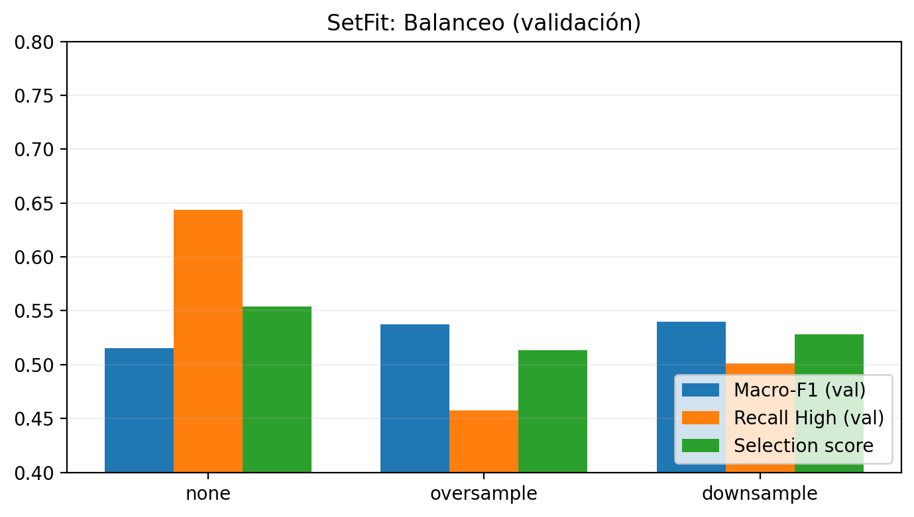
Interpretación: oversample/downsample elevan ligeramente macro-F1, pero penalizan recall High; la mejor relación queda con `none`.

Conclusión: aunque oversample/downsample mejoran ligeramente el macro-F1, **reducen el recall de `High`**, lo que baja el *selection score*. Por tanto, se mantiene **none** como estrategia final al priorizar la detección de tickets críticos.

---

**Mejores configuraciones (validación, top-5 por selection score)**  
| Configuración | Iter | Epochs | Batch | LR | Macro-F1 (val) | Recall High (val) | Selection Score |
|---|---:|---:|---:|---:|---:|---:|---:|
| all-MiniLM-L6-v2 | 10 | 2 | 32 | 5e-05 | 0.644 | 0.733 | 0.671 |
| all-MiniLM-L6-v2 | 10 | 2 | 16 | 5e-05 | 0.648 | 0.703 | 0.664 |
| all-MiniLM-L6-v2 | 10 | 2 | 16 | 2e-05 | 0.589 | 0.717 | 0.627 |
| all-MiniLM-L6-v2 | 5 | 2 | 16 | 5e-05 | 0.565 | 0.695 | 0.604 |
| all-MiniLM-L6-v2 | 10 | 2 | 32 | 2e-05 | 0.565 | 0.678 | 0.599 |

**Figura 6.3-A — Top configuraciones (validación)**  
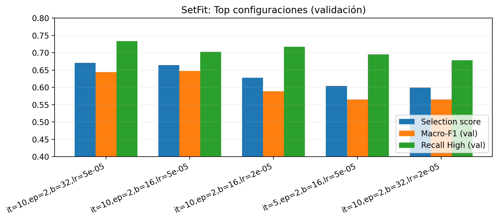
Interpretación: las mejores configuraciones convergen en `num_iterations=10` y `num_epochs=2`, con diferencias moderadas entre batch y learning rate.

---

#### Resultados obtenidos

**Mejor modelo SetFit (test):** `sentence-transformers/all-MiniLM-L6-v2`, iter=10, epochs=2, batch=32, LR=5e-05

Métricas finales:

| Métrica | Valor |
|--------|-------|
| Macro F1 | 0.699 |
| Recall High | 0.742 |
| Precision High | 0.770 |
| Accuracy | 0.714 |

El mejor modelo obtenido corresponde a la configuración:

- Modelo base: `sentence-transformers/all-MiniLM-L6-v2`
- Número de iteraciones: 10
- Número de épocas: 2
- Batch size: 32
- Learning rate: 5e-05

Este modelo alcanza un **Macro F1 de 0.6992** y un **Recall en la clase High de 0.7424**, mostrando un buen equilibrio entre rendimiento global y alineación con el objetivo de negocio.

Matriz de confusión (test):

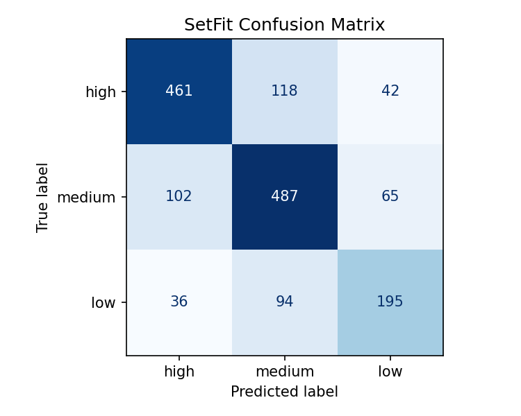

A partir de la matriz de confusión se observa que el modelo aprende una **estructura ordinal implícita de prioridades**, donde los errores se concentran principalmente entre clases adyacentes, mientras que las confusiones extremas (High ↔ Low) son minoritarias. Este comportamiento es consistente con la naturaleza del problema y resulta adecuado desde el punto de vista operativo.

---

#### Conclusión del enfoque SetFit

**Modelo seleccionado dentro del enfoque:**  
**SetFit con `sentence-transformers/all-MiniLM-L6-v2`**

SetFit logra resultados competitivos en términos de **detección de tickets críticos**, mostrando una buena capacidad de adaptación semántica al dominio y un patrón de errores coherente con la estructura ordinal del problema.

No obstante, el aumento de complejidad del pipeline y el coste de entrenamiento **no compensan la mejora obtenida frente al baseline TF-IDF**, por lo que este enfoque se considera una **alternativa avanzada**, pero no la opción final seleccionada.


---

### 6.4 Zero-shot / Few-shot con LLMs

#### Motivación del enfoque

Como complemento a los enfoques supervisados entrenados específicamente sobre el dataset, se explora el uso de **Large Language Models (LLMs)** en escenarios *zero-shot* y *few-shot*.

El objetivo de este bloque es **servir como referencia exploratoria**, para:

- evaluar la **capacidad de generalización sin entrenamiento supervisado**,
- analizar la **sensibilidad al prompt y al número de ejemplos**,
- establecer un **benchmark de referencia** frente a modelos entrenados,
- y cuantificar limitaciones prácticas como **latencia, coste y robustez operativa**.

Este enfoque resulta relevante en contextos donde no existe histórico etiquetado o se requiere una estimación rápida del problema, pero se evalúa aquí únicamente como **referencia comparativa**.

---

#### Enfoque experimental

El LLM recibe como entrada:
- el texto del ticket (`Body`),
- el departamento (`Department`),
- una instrucción en lenguaje natural que define las clases `high`, `medium` y `low`.

La salida esperada es una única etiqueta de prioridad.  
No se realiza ningún tipo de entrenamiento ni ajuste de pesos del modelo.

Se evalúan escenarios **zero-shot** (sin ejemplos) y **few-shot** (1–6 ejemplos), extrayendo los ejemplos exclusivamente del conjunto de entrenamiento y manteniendo el conjunto de test **completamente aislado**.

---

#### Modelos evaluados

- **DeepSeek-R1:8B (local, Ollama)**  
  Modelo ejecutado localmente, sin coste por llamada y con control completo del pipeline.

- **Gemini 2.5 Flash Lite (cloud)**  
  Modelo cloud de baja latencia, evaluado de forma exploratoria debido a limitaciones de cuota y estabilidad de la API.

---

#### Diseño del prompt y robustez operativa

Se evalúan dos estilos de prompt:

- `base`: instrucción genérica sin reglas explícitas,
- `rules`: prompt con reglas de negocio explícitas.

Se monitorizan explícitamente métricas de robustez:
- **Coverage**: proporción de respuestas válidas,
- **Invalid rate**: porcentaje de salidas no utilizables,
como indicadores de viabilidad operativa.

---

#### Resultados cuantitativos

##### Sensibilidad al número de ejemplos (DeepSeek)

Análisis del impacto del número de ejemplos *few-shot*, manteniendo fijo el modelo, el prompt y la semilla.

| Prompt | #Ejemplos | Macro-F1 | Recall High | Precision High | Pred High (%) |
|------|-----------|----------|-------------|----------------|-------------|
| base | 0 | 0.335 | 0.450 | 0.425 | 35.3 |
| base | 3 | 0.404 | 0.270 | 0.435 | 20.7 |
| base | 6 | 0.386 | 0.200 | 0.541 | 12.3 |

**Observaciones**:
- el paso de *zero-shot* a *few-shot* reduce la sobre-priorización de la clase `High`,
- aumenta la precisión en dicha clase, pero a costa de una caída significativa del *recall*,
- se observa una ganancia limitada en *macro-F1*, con saturación a partir de pocos ejemplos,
- el comportamiento del modelo cambia de forma sensible según la configuración.

---

##### Sensibilidad al prompt (DeepSeek)

Comparación entre distintos estilos de prompt manteniendo constante el número de ejemplos.

| Prompt | #Ejemplos | Macro-F1 | Recall High | Coverage |
|-------|-----------|----------|-------------|-------------|
| base | 6 | 0.386 | 0.200 | 1.00 |
| rules | 6 | 0.399 | 0.360 | 1.00 |

El uso de reglas explícitas mejora el *recall* de la clase crítica, aunque **sin alcanzar niveles competitivos** frente a modelos supervisados.

---

##### Estabilidad entre ejecuciones (DeepSeek)

Evaluación de la variabilidad del modelo frente a distintas semillas, utilizando la configuración más favorable.

| Seed | Macro-F1 | Recall High |
|------|----------|-------------|
| 0 | 0.400 | 0.460 |
| 1 | 0.383 | 0.470 |
| 2 | 0.370 | 0.410 |
| **Media ± Std** | **0.385 ± 0.012** | **0.447 ± 0.026** |

**Figura G4 — Estabilidad entre ejecuciones (DeepSeek rules 6)**  
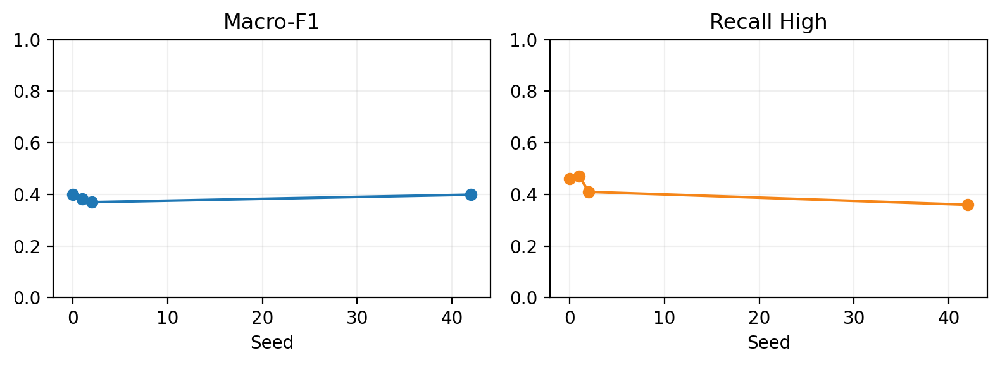

Este análisis evidencia una **variabilidad no despreciable** entre ejecuciones, lo que limita la reproducibilidad y el control del comportamiento del modelo.

---

##### Comparación entre modelos (DeepSeek vs Gemini)

Comparación exploratoria entre un modelo local y uno cloud bajo configuraciones distintas.

| Modelo | Prompt | #Ejemplos | Macro-F1 | Recall High | Coverage | Latencia media (ms) |
|-------|--------|-----------|----------|-------------|----------|---------------------|
| DeepSeek-R1:8B | rules | 6 | 0.399 | 0.360 | 1.00 | 4466.97 |
| Gemini 2.5 Flash Lite | rules | 6 | 0.394 | 0.382 | 1.00 | 529.40 |

En Gemini se observa menor latencia y **cobertura completa** con el prompt `rules`, pero el rendimiento sigue siendo inferior al de los modelos supervisados y mantiene el trade-off entre precisión y recall en `High`.

**Figura G2 — Trade-off Precision vs Recall en LLMs (DeepSeek/Gemini)**  
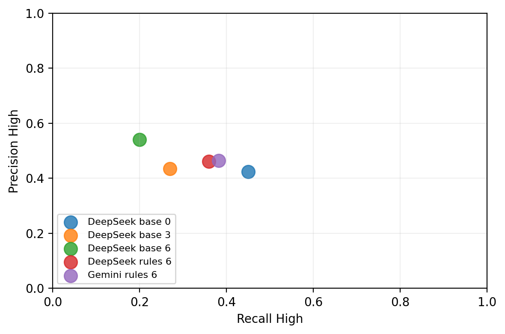

---

#### Métricas específicas para LLMs

Además de las métricas técnicas habituales, se utilizan métricas específicas para este enfoque:

- **Over-triage factor**: proporción de tickets clasificados como `High` frente a la proporción real.
- **Coverage** y **invalid rate** como métricas de robustez operativa.
- **Latencia media y p95** como indicadores de viabilidad técnica.

Estas métricas permiten evaluar la viabilidad del enfoque más allá del rendimiento técnico.

---

#### Conclusión del enfoque Zero-shot / Few-shot

Los experimentos realizados con **DeepSeek-R1:8B** muestran que el uso de LLMs en escenarios *zero-shot* y *few-shot* presenta **limitaciones estructurales** que impiden su uso como sistema automático de priorización de tickets.

En escenarios *zero-shot*, el modelo tiende a **sobre-priorizar la clase `High`**, obteniendo un *recall* moderado a costa de un elevado coste operativo y una baja precisión global. Al introducir ejemplos *few-shot*, se reduce la sobre-priorización y aumenta la precisión, pero con una **caída significativa del recall**, en conflicto directo con el objetivo de negocio.

El uso de prompts basados en reglas mejora parcialmente la detección de tickets críticos, pero **no logra cerrar la brecha** respecto a los modelos supervisados entrenados sobre el dominio. Además, la variabilidad observada entre ejecuciones evidencia una **falta de estabilidad y control operativo**.

En conjunto, los resultados se sitúan **muy por debajo del baseline TF-IDF y del enfoque SetFit** en métricas técnicas clave, estabilidad y control del comportamiento.  
Por estos motivos, el enfoque *zero-shot / few-shot* se descarta como solución productiva y se mantiene **exclusivamente como benchmark conceptual**, útil para contextualizar la dificultad del problema y validar empíricamente la necesidad de entrenamiento supervisado.


---

## 7. Comparativa global y selección del modelo final

En esta sección se sintetizan los resultados obtenidos para los **mejores modelos seleccionados dentro de cada familia de enfoques**, evaluados sobre el conjunto de test con las mismas métricas.

La comparativa se centra en cuatro dimensiones clave:
- **Rendimiento global** (macro-F1),
- **Detección de tickets críticos** (recall de la clase High),
- **Viabilidad operativa** (coste computacional y latencia),
- **Alineación con el objetivo de negocio** (impacto en SLA).

El objetivo no es únicamente maximizar métricas técnicas, sino seleccionar un modelo **robusto, interpretable y operativo** en un entorno real de soporte IT.

---

### 7.1 Resumen comparativo por enfoque

La siguiente tabla resume los resultados más representativos de cada enfoque:

**Figura G1 — Comparativa global por enfoques (Macro-F1 / Recall High)**  
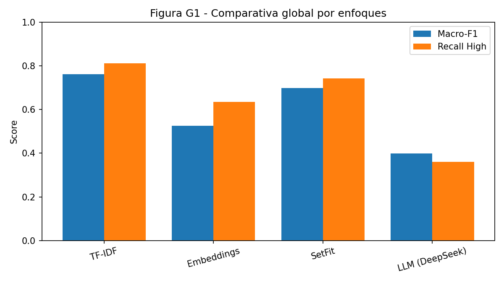

| Enfoque | Modelo seleccionado | Macro-F1 (test) | Recall High (test) | Complejidad | Rol en el proyecto |
|-------|---------------------|------------------|--------------------|-------------|-------------------|
| TF-IDF | Linear SVM + metadatos | **0.762** | **0.811** | Baja | ✅ Modelo final |
| Embeddings | all-mpnet-base-v2 + body_ohe_num + Linear SVM (C=2.0) | 0.525 | 0.636 | Media | Referencia avanzada |
| SetFit | all-MiniLM-L6-v2 fine-tuned | 0.699 | 0.742 | Alta | Alternativa robusta |
| Zero / Few-shot | DeepSeek-R1:8B (rules, 6) | 0.399 | 0.360 | Muy alta | Benchmark |

**Notas de interpretación**:
- TF-IDF ofrece el mejor equilibrio entre rendimiento global y protección de la clase crítica.
- SetFit logra resultados competitivos, pero con mayor complejidad y coste.
- Los embeddings densos no superan al modelo final seleccionado en métricas clave de negocio.

---

### 7.2 Análisis comparativo cualitativo

Desde una perspectiva operativa y de negocio:

- **TF-IDF + Linear SVM** destaca por:
  - alta interpretabilidad,
  - estabilidad entre ejecuciones,
  - bajo coste computacional,
  - y control explícito del impacto de errores críticos.

- **Embeddings + clasificadores lineales** aportan mayor capacidad semántica, pero:
  - no reducen de forma consistente los errores `High → Low`,
  - incrementan la complejidad del pipeline,
  - y no mejoran el impacto en SLA.

- **SetFit** muestra una buena adaptación al dominio y una estructura de errores coherente, pero:
  - requiere entrenamiento contrastivo,
  - introduce mayor coste y complejidad,
  - y no justifica el cambio frente al modelo final seleccionado más simple.

- **LLMs en zero-shot / few-shot** presentan:
  - alta dependencia del prompt,
  - variabilidad entre ejecuciones,
  - mayor latencia y menor control operativo,
  - lo que limita su uso como sistema automático de priorización.

---

### 7.3 Modelo seleccionado

A partir del análisis cuantitativo y cualitativo, se selecciona como **modelo final del proyecto**:

**➡️ TF-IDF + Linear SVM + metadatos operativos**

Esta decisión se fundamenta en:

- el mejor equilibrio entre **macro-F1** y **recall de la clase High**,
- la minimización de errores con impacto directo en SLA,
- el menor coste computacional y latencia,
- y la alta interpretabilidad del modelo, clave en entornos operativos.

El modelo seleccionado cumple el objetivo principal del proyecto:  
**priorizar correctamente los tickets críticos reduciendo el riesgo de incumplimiento de SLA**, sin introducir complejidad innecesaria en el sistema.

---

### 7.4 Profundización en el modelo ganador (TF-IDF)

Dado que el enfoque basado en **TF-IDF + modelos lineales** obtiene el mejor rendimiento global y cumple los requisitos de interpretabilidad y alineación con el objetivo de negocio, se profundiza a continuación en su análisis, limitaciones y potencial de mejora.

#### Análisis de errores orientado a SLA (confusiones críticas)

Más allá de las métricas agregadas, se analiza la **matriz de confusión** del modelo final con especial atención a los errores con mayor impacto operativo:

- **Falsos negativos en `High` (High → Medium / Low)**  
  Representan tickets críticos no detectados correctamente, con riesgo directo de incumplimiento de SLA.

- **Errores extremos (High → Low)**  
  Son el caso más severo, ya que el ticket pierde completamente su prioridad.

- **Errores adyacentes (High → Medium)**  
  Aunque incorrectos, mantienen cierto nivel de priorización y su impacto operativo es menor.

En el modelo final TF-IDF se observa que:
- la mayoría de errores de la clase `High` se desplazan hacia `Medium`,
- los errores `High → Low` son minoritarios,
- el **recall High = 0.811** implica que se pierden ~**19%** de los `High` (≈ **435** tickets en test).

Esto es coherente con el objetivo del sistema, que prioriza **no perder tickets críticos**, incluso aceptando cierta sobre-priorización en clases intermedias.

Matriz de confusión (TF-IDF):


#### Interpretabilidad del modelo (ventaja clave del TF-IDF)

Una ventaja fundamental del enfoque TF-IDF combinado con modelos lineales es su **alto grado de interpretabilidad**.

El clasificador aprende pesos asociados a términos y n-gramas concretos del texto, lo que permite:

- identificar qué expresiones impulsan la clasificación como `High`, `Medium` o `Low`,
- validar que el modelo se apoya en señales semánticas plausibles del dominio,
- detectar posibles sesgos (por ejemplo, términos que activan `High` sin ser realmente críticos),
- facilitar la explicación del modelo en un entorno operativo.

Si fuera necesario profundizar en auditorías puntuales, es posible **extraer top n-gramas por clase** a partir de los coeficientes del modelo y el vocabulario del vectorizador, reforzando la trazabilidad del sistema.

#### Métricas complementarias y coherencia con la estrategia global

Además de las métricas principales (macro-F1 y recall de `High`), puede considerarse la **balanced accuracy** como métrica diagnóstica complementaria.

La balanced accuracy resume el recall medio por clase y permite detectar rápidamente si el modelo ignora sistemáticamente alguna categoría. No se utiliza como métrica principal de optimización, pero resulta útil para validar el equilibrio global del clasificador.

#### Exploración del techo de rendimiento del modelo final seleccionado (TF-IDF)

Aunque el modelo final seleccionado (TF-IDF) se considera cerrado a nivel experimental, existen extensiones de **bajo coste y alta justificabilidad** que permitirían explorar su techo de rendimiento sin introducir complejidad excesiva:

1. **Ajuste del umbral para la clase `High` (High vs Rest)**  
   En un contexto de SLA, puede ser preferible maximizar el recall de `High` controlando el sobre-triaje. Esto puede lograrse calibrando probabilidades y ajustando el umbral de decisión para dicha clase.

2. **Evaluación por segmentos (slice metrics)**  
   Analizar métricas como macro-F1 y recall `High` por `Department` permite evaluar la robustez del modelo y detectar posibles diferencias de rendimiento entre áreas funcionales.

Estas extensiones mantienen la misma familia de modelos y preservan la trazabilidad del pipeline, por lo que son adecuadas como trabajo futuro inmediato.

#### Conclusión del análisis en profundidad

El enfoque TF-IDF + Linear SVM no solo presenta el mejor rendimiento cuantitativo entre las alternativas evaluadas, sino que ofrece:

- interpretabilidad directa,
- control explícito de errores críticos,
- alineación clara con el objetivo de negocio,
- y una base sólida sobre la que introducir enfoques más complejos.

Por estos motivos, se consolida como **modelo final seleccionado** y punto de referencia para comparar soluciones basadas en embeddings, fine-tuning y modelos de lenguaje en fases posteriores del proyecto.

---

### 7.5 Conclusión de la comparativa

La exploración sistemática de distintos enfoques confirma que, en este problema concreto:

- modelos clásicos bien configurados pueden superar a soluciones más complejas,
- la semántica adicional no siempre se traduce en mejora operativa,
- y la simplicidad, cuando va acompañada de buen diseño experimental, es una ventaja real.

Este resultado refuerza la importancia de **alinear las decisiones técnicas con el objetivo de negocio**, priorizando robustez, trazabilidad y control del impacto sobre métricas puramente sofisticadas.


---

## 8. Explicabilidad del modelo

La explicabilidad del sistema es un aspecto clave del proyecto, dado que el modelo seleccionado se utiliza para **priorizar incidencias con impacto directo en el cumplimiento de SLA**. En este contexto, no solo importa el rendimiento del modelo, sino también la **capacidad de entender, auditar y justificar sus decisiones**.

La explicabilidad se aborda desde tres niveles complementarios: interpretabilidad intrínseca del modelo, análisis de errores críticos y comparación entre enfoques.

---

### 8.1 Explicabilidad intrínseca del modelo TF-IDF

El modelo seleccionado (**TF-IDF + Linear SVM**) presenta una ventaja fundamental frente a enfoques más complejos: su **interpretabilidad intrínseca**.

La interpretabilidad del modelo se basa principalmente en la naturaleza lineal de TF-IDF y sus coeficientes. Las técnicas de explicabilidad local se utilizan como complemento para auditar casos concretos, no como requisito para entender el comportamiento global del modelo.

En este proyecto se distingue entre:
- **Interpretabilidad**: capacidad de entender el comportamiento global del modelo a partir de su estructura (coeficientes TF-IDF + modelo lineal).
- **Explicabilidad**: capacidad de justificar decisiones individuales mediante técnicas locales (SHAP).

El enfoque TF-IDF destaca especialmente en interpretabilidad intrínseca, reduciendo la dependencia de técnicas de explicabilidad post-hoc.

TF-IDF permite asociar pesos explícitos a términos y n-gramas del texto, lo que hace posible:

- identificar qué palabras o expresiones contribuyen a clasificar un ticket como `High`, `Medium` o `Low`,
- validar que el modelo aprende señales coherentes con el dominio del problema,
- detectar posibles sesgos léxicos o dependencias espurias,
- y explicar decisiones de priorización a equipos de soporte.

A diferencia de modelos basados en embeddings densos o LLMs, el razonamiento del modelo no está encapsulado en representaciones opacas, sino que puede ser inspeccionado directamente a través de sus coeficientes.

Esta característica resulta especialmente valiosa en entornos operativos, donde la **confianza en el sistema** es tan importante como su rendimiento técnico.

Para explicabilidad local se prioriza **SHAP** (LinearExplainer) frente a LIME porque, en modelos lineales con TF-IDF, SHAP es exacto, estable y coherente con los coeficientes del clasificador. Esto evita la variabilidad de muestreo de LIME y permite justificar decisiones con mayor consistencia.

Las técnicas de explicabilidad local (SHAP) se utilizan únicamente como complemento para auditar decisiones individuales, no como mecanismo principal para entender el comportamiento global del modelo, que se explica directamente a través de sus coeficientes.

Los términos mostrados corresponden a los n-gramas con mayor peso absoluto en los coeficientes del clasificador lineal, una vez entrenado el modelo final.

Artefactos de explicabilidad TF-IDF:
- `reports/figures/tfidf_global_<label>.png` (top n-gramas por clase).
- `reports/explainability_tfidf/local_<idx>_<true>_<pred>.png` (explicaciones locales).
- `reports/explainability_tfidf/summary.json` (resumen global/local).

Ejecución:
```
python -m src.explainability_tfidf
```

**Figura E1 — TF-IDF global (top n-gramas por clase)**  
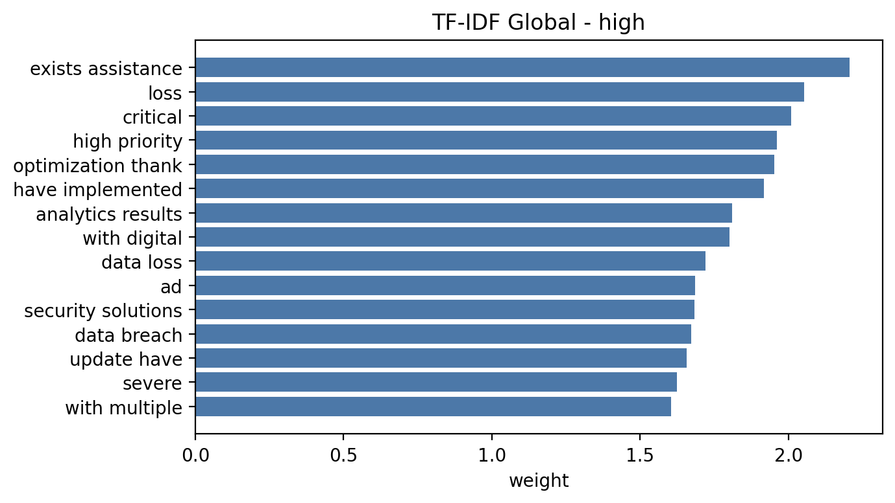
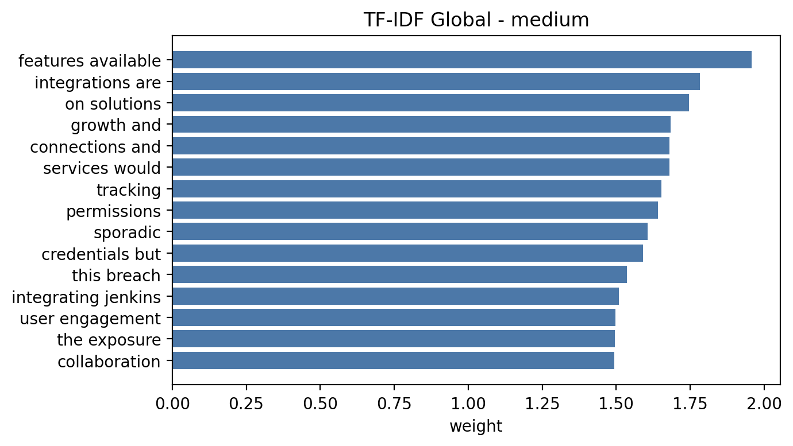
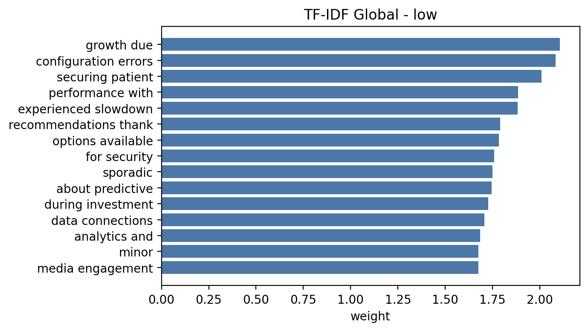

Ejemplos de términos con mayor peso absoluto:
- `High`: "critical", "loss", "exists assistance".
- `Medium`: "on solutions", "integrations are", "features available".
- `Low`: "securing patient", "configuration errors", "growth due".

---

### 8.2 Explicabilidad basada en el análisis de errores

Tras entender qué aprende el modelo, se analiza cómo y por qué falla en los casos con mayor impacto operativo.

La explicabilidad no se limita a entender por qué el modelo acierta, sino también **por qué falla**.

Por este motivo, se analiza en detalle la **matriz de confusión**, centrándose en los errores con mayor impacto de negocio:

- **High -> Medium / Low**: tickets críticos no detectados.
- **High -> Low**: errores extremos con mayor riesgo operativo.
- **Confusiones entre clases adyacentes**: errores menos severos desde el punto de vista de SLA.

El análisis muestra que:
- la mayoría de errores de la clase `High` se concentran en confusiones hacia `Medium`,
- los errores extremos `High -> Low` son minoritarios,
- el patrón de errores respeta en gran medida la estructura ordinal implícita del problema.

Este comportamiento es interpretable y coherente con el objetivo del sistema, y permite razonar de forma explícita sobre el impacto real de los errores en la operación.

**Figura E2 — Explicaciones locales (ejemplos TF-IDF + SHAP)**  
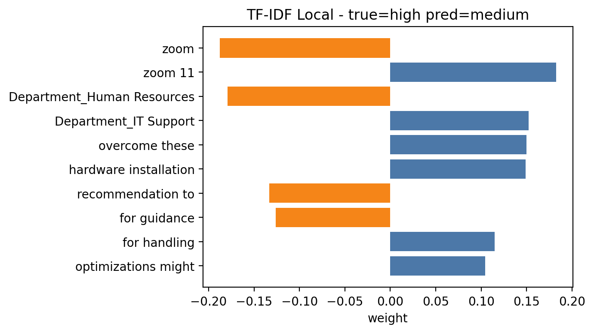
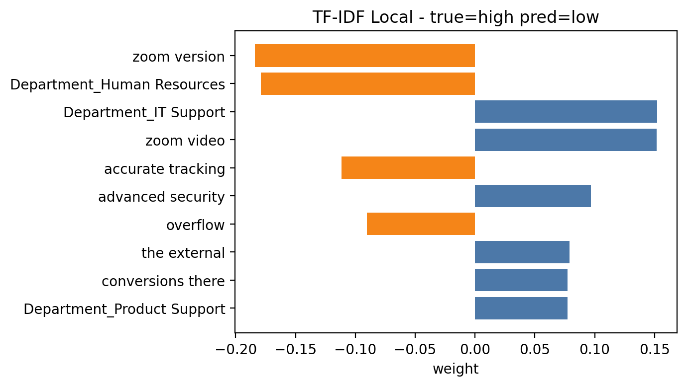

Interpretación de los pesos locales (SHAP):  
los valores **positivos** empujan la predicción hacia la clase **predicha** en la figura, mientras que los valores **negativos** actúan en sentido contrario (aportan evidencia contra esa clase y, por tanto, a favor de otras). En un error, los positivos explican por qué el modelo se inclina por la clase incorrecta, y los negativos muestran señales que apuntaban a la clase verdadera pero no fueron suficientes.

En el primer ejemplo, un ticket `High` se clasifica como `Medium`. La explicación muestra señales semánticas ambiguas, con términos de impacto moderado que dominan sobre indicadores críticos, lo que explica el error sin introducir comportamientos inesperados.

En el segundo ejemplo, un ticket `High` se clasifica como `Low`. La explicación expone cómo señales de menor severidad dominan la decisión, ilustrando el tipo de error extremo que se desea minimizar.

---

### 8.3 Explicabilidad comparativa entre enfoques

Con este marco, se compara la explicabilidad entre familias para justificar la elección final.

La explicabilidad también se analiza de forma comparativa entre las distintas familias de modelos evaluadas:

- **TF-IDF + modelos lineales**  
  Alta interpretabilidad, control explícito de señales y errores, trazabilidad completa.

- **Embeddings + clasificadores lineales**  
  Mejora potencial en semántica, pero menor transparencia sobre qué aspectos del texto impulsan la decisión final.

- **SetFit**  
  Capacidad de adaptación semántica al dominio, pero con menor interpretabilidad del espacio aprendido y mayor coste de análisis.

- **LLMs zero-shot / few-shot**  
  Baja explicabilidad, alta dependencia del prompt y variabilidad entre ejecuciones, lo que dificulta justificar decisiones individuales.

Este análisis refuerza la elección del **modelo final seleccionado (TF-IDF + Linear SVM)**, no solo por su rendimiento, sino por su **mayor grado de explicabilidad y control operativo**.

---

### 8.4 Límites de la explicabilidad y trabajo futuro

Aunque el modelo TF-IDF ofrece un alto grado de interpretabilidad, existen límites inherentes:

- los pesos de términos no capturan relaciones semánticas profundas,
- la explicación se produce a nivel léxico, no conceptual,
- no se modelan explícitamente relaciones causales.

Como trabajo futuro, podrían incorporarse técnicas adicionales de explicabilidad (por ejemplo, análisis de contribución de features por instancia) si el contexto operativo lo requiere.

---

### 8.5 Conclusiones de explicabilidad

La explicabilidad del modelo TF-IDF cumple los requisitos del proyecto por tres motivos principales:

- **Coherencia global**: los n-gramas más influyentes por clase muestran patrones consistentes con el dominio, lo que facilita validar que el modelo no aprende señales espurias.
- **Trazabilidad local**: las explicaciones por instancia permiten auditar casos concretos, identificar errores repetitivos y justificar decisiones frente a equipos de soporte.
- **Alineación operativa**: el análisis de errores críticos y la baja incidencia de confusiones extremas permiten conectar la explicabilidad con el impacto en SLA.

En conjunto, la combinación de explicabilidad global (coeficientes), local (SHAP) y análisis de errores ofrece un marco suficiente para defender el modelo en un entorno real, y explica por qué el **modelo final seleccionado (TF-IDF + Linear SVM)** sigue siendo el enfoque más controlable y auditable del proyecto.

---

## 9. Métricas de negocio y simulación de impacto

Esta sección conecta el rendimiento del modelo con el **objetivo operativo** del proyecto: priorizar correctamente incidencias con impacto directo en SLA.

### 9.1 Objetivo de negocio y foco en la clase `High`

En la operación real, **no todos los errores cuestan lo mismo**.  
Un falso negativo en `High` implica retrasar tickets críticos, con riesgo de incumplimiento de SLA y costes asociados (operativos o contractuales).  
Por eso, el análisis y la selección del modelo priorizan **recall de `High`** y el control de errores `High → Medium/Low`.

### 9.2 Traducción de errores a impacto

Se utiliza un único nivel de traducción a negocio, con supuestos explícitos:

- **Gap de horas (proxy de SLA)**  
  Se asigna un objetivo de tiempo por clase: `High=4`, `Medium=8`, `Low=12` horas.  
  Se calcula el **`mean_gap`** como `mean(|objetivo_pred - objetivo_real|)`, y se compara frente a un **baseline aleatorio estratificado por clase**.  
  Esta simulación **no modela colas ni tiempos reales**, sino la coherencia de la priorización con los objetivos de respuesta.

### 9.3 Resultados

En la simulación con semilla fija, el modelo reduce el `mean_gap` frente al baseline aleatorio:

- Modelo: **1.08h** (mean_gap) y **77.12%** de acierto.  
- Aleatorio: **3.21h** (mean_gap) y **35.72%** de acierto.

Esto supone una **reducción media de 2.13h** en el gap respecto a un baseline no entrenado.

Cómo leer estos valores:
- Con objetivos `4/8/12h`, los gaps posibles son **0h, 4h o 8h**.  
- **0h** = acierto exacto de clase.  
- **4h** = error adyacente (`High ↔ Medium` o `Medium ↔ Low`).  
- **8h** = error extremo (`High ↔ Low`), el más costoso en operación.

Para visualizar la severidad del error, se muestra la distribución del gap:
- **Modelo**: 0h **77.12%**, 4h **18.72%**, 8h **4.17%**.  
- **Aleatorio**: 0h **35.72%**, 4h **48.26%**, 8h **16.02%**.

La mejora no es solo en media: el modelo **concentra la mayoría de casos en 0h** y reduce drásticamente los errores extremos (8h), que son los más dañinos para el SLA.

### 9.4 Ejecución y trazabilidad

El cálculo se obtiene con el script `src.business_metrics`, que guarda un resumen en:
- `reports/business_metrics_simple.json`

```
BUSINESS_SEED=42 python -m src.business_metrics
```

Parámetros útiles:
- `BUSINESS_AGENTS`: número de agentes en la simulación.
- `BUSINESS_HORIZON_H`: horizonte temporal en horas.

---

## 10. Despliegue conceptual en un entorno real

Esta sección describe de forma conceptual cómo se integraría el modelo final seleccionado (TF-IDF + clasificador lineal) en un entorno real de soporte IT. De acuerdo con el enunciado del TFM, este apartado no requiere implementación técnica, sino demostrar comprensión del ciclo de vida completo del modelo en un contexto empresarial.

---

### 10.1 Escenario de uso

El modelo se integraría en un sistema de **gestión de tickets de soporte (Service Desk)** utilizado por una organización con múltiples departamentos técnicos.

Cuando se crea un nuevo ticket:
- el usuario introduce un **título y una descripción textual**,
- opcionalmente se asignan etiquetas o un departamento inicial,
- el sistema solicita una **predicción automática de prioridad** (`High`, `Medium`, `Low`).

El objetivo principal es **asistir al triaje inicial**, reduciendo el tiempo de respuesta ante incidencias críticas y mejorando el cumplimiento de los SLA.

---

### 10.2 Tipo de ejecución

El modelo funcionaría en **modo online (tiempo casi real)**:

- cada ticket se procesa individualmente en el momento de su creación,
- el pipeline de inferencia es ligero (vectorización TF-IDF + modelo lineal),
- la latencia esperada es del orden de milisegundos.

Este enfoque es coherente con:
- el bajo coste computacional del modelo,
- la necesidad de respuesta inmediata en sistemas interactivos de soporte.

---

### 10.3 Arquitectura conceptual del sistema

El flujo completo del sistema podría describirse de la siguiente forma:

1. **Entrada**: texto del ticket (título + descripción).
2. **Preprocesado**:
   - limpieza básica del texto,
   - vectorización mediante el vocabulario TF-IDF entrenado.
3. **Predicción**:
   - el clasificador asigna una prioridad (`High`, `Medium`, `Low`).
4. **Salida**:
   - la prioridad predicha se almacena junto al ticket,
   - se utiliza para ordenación automática o como recomendación al agente.

El modelo podría exponerse mediante:
- una **API interna** (por ejemplo, REST),
- o un **servicio ligero** integrado en el backend del sistema de tickets.

---

### 10.4 Reentrenamiento del modelo

El modelo se reentrenaría de forma **periódica**, por ejemplo:
- **mensualmente** o **trimestralmente**, en función del volumen de tickets,
- o de forma extraordinaria si se detectan cambios relevantes en los datos.

El proceso de reentrenamiento incluiría:
- incorporación de nuevos tickets históricos ya resueltos,
- recalculado del vocabulario TF-IDF,
- evaluación comparativa frente al modelo actualmente desplegado.

Solo se promovería un nuevo modelo a producción si **mejora o mantiene** las métricas clave, especialmente el *recall* de la clase `High`.

---

### 10.5 Monitorización del rendimiento y data drift

En producción se monitorizarían de forma continua:
- la **distribución de predicciones** (`High` / `Medium` / `Low`),
- métricas técnicas calculadas a posteriori cuando se dispone de la etiqueta real,
- la evolución temporal del rendimiento del modelo.

Asimismo, se vigilarían señales de **data drift**, como:
- aparición de términos nuevos no presentes durante el entrenamiento,
- cambios en el estilo o longitud de los textos,
- variaciones significativas en la distribución de departamentos.

Estas señales servirían como indicadores para un reentrenamiento anticipado.

---

### 10.6 Actualización y versionado

Cada versión del modelo estaría:
- versionada (por ejemplo, `v1`, `v2`, `v3`),
- asociada a un conjunto concreto de datos y parámetros,
- documentada con sus métricas técnicas y de negocio.

Esto permitiría:
- comparar versiones históricas,
- revertir a un modelo anterior si fuera necesario,
- mantener trazabilidad completa de las decisiones tomadas.

---

### 10.7 Rol del modelo en el proceso de negocio

El modelo no sustituye al agente humano, sino que actúa como:
- una **herramienta de apoyo al triaje**,
- un sistema de **priorización automática inicial**,
- una base cuantitativa para mejorar el cumplimiento de SLA.

El impacto en negocio se refleja en:
- reducción del tiempo de atención de incidencias críticas,
- menor riesgo de penalizaciones por incumplimiento de SLA,
- mejor asignación de los recursos del equipo de soporte.

---

### 10.8 Posibles mejoras futuras

En una versión futura del sistema podrían explorarse:
- modelos híbridos que combinen texto y metadatos adicionales,
- adaptación del modelo por departamento,
- incorporación de feedback explícito de los agentes,
- evaluación de modelos más complejos si el coste computacional lo justifica.

Estas mejoras se plantean como líneas futuras, manteniendo siempre el equilibrio entre rendimiento, coste y explicabilidad.


---

## 11. Conclusiones y trabajo futuro

### 11.1 Aprendizajes clave

- El **modelo final seleccionado (TF-IDF + Linear SVM)** ofrece el mejor equilibrio entre rendimiento, interpretabilidad y control operativo.  
- En problemas con SLA, **recall High** es la métrica determinante y debe guiar la selección.  
- La explicabilidad no es un añadido: es un requisito para adopción y confianza en operación.  
Este proyecto demuestra que, en problemas con impacto operativo real, un diseño experimental sólido y alineado con negocio puede ser más determinante que la complejidad del modelo empleado.

### 11.2 Limitaciones reales

- No se dispone de validación temporal para evaluar drift real.  
- La simulación de negocio utiliza costes proxy, no costes reales del soporte.  
- No se incorpora feedback humano en producción (loop de mejora continua).  

### 11.3 Trabajo futuro inmediato

Mejoras directas y coherentes con el modelo final seleccionado:
- ajuste del umbral de decisión para la clase `High`, priorizando recall frente a sobre-triaje,  
- evaluación por segmentos (slice metrics) para validar robustez por `Department`,  
- incorporación explícita de métricas de negocio (coste, SLA) a partir de la matriz de confusión,  
- incorporación de feedback humano para calibración y mejora iterativa.

Estas extensiones no alteran la familia de modelos y permiten profundizar en el impacto operativo sin introducir complejidad innecesaria.
